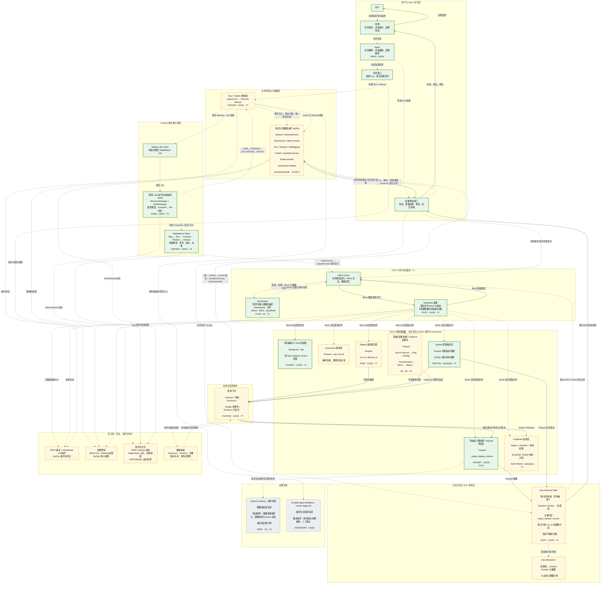
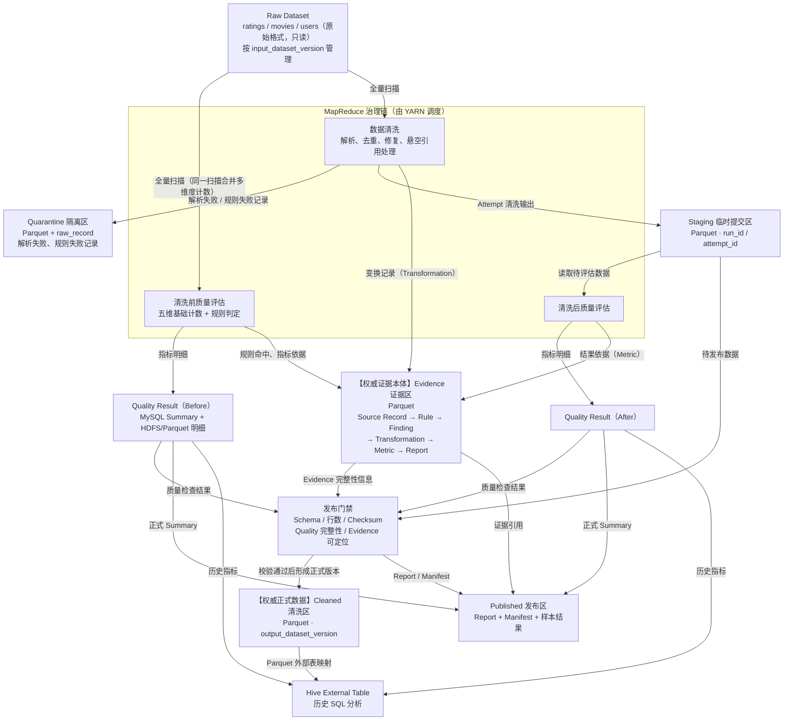
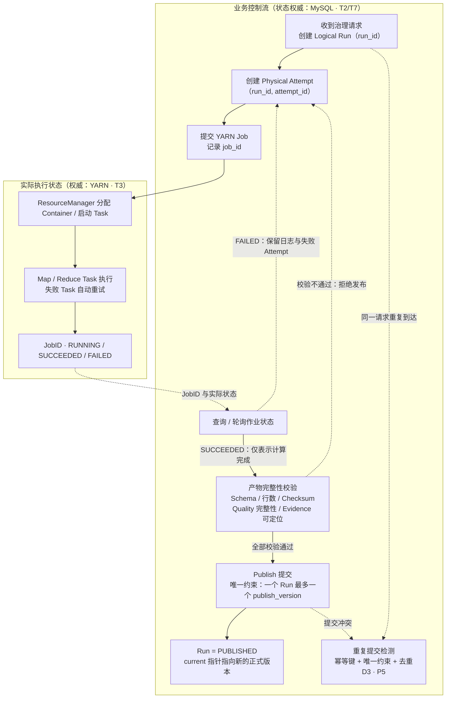
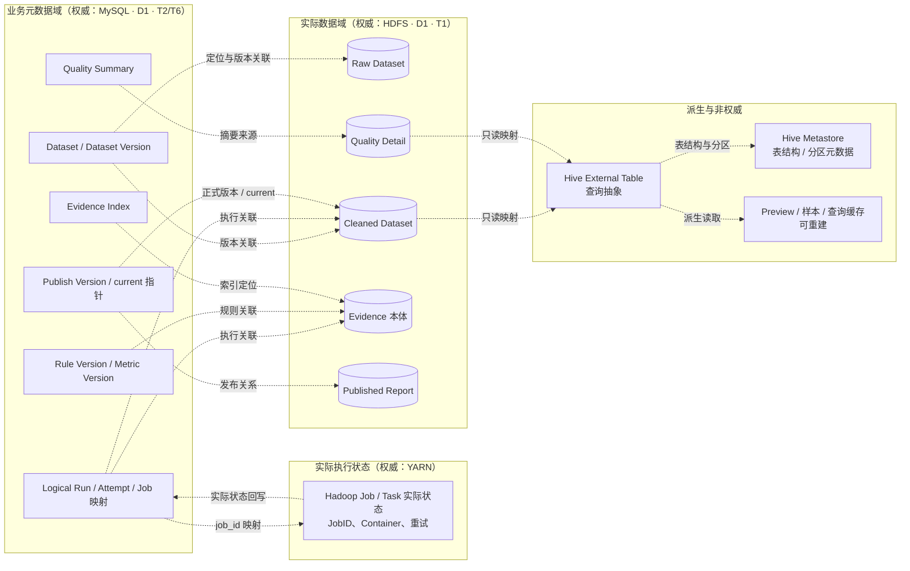

# 作业三：MovieLens 数据治理 Agent 大数据存储与处理技术选型

**课程主题：** 大数据分析  
**研究对象：** MovieLens 数据治理 Agent  
**组队序号：** 9  
**组队名：** BUG二改就队  

# 1. 输入与追踪关系

## 1.1 前序架构设计输入

MovieLens 数据治理 Agent 的技术选型直接承接前序架构设计中的 P1～P9 和 D1～D6。系统的核心业务链为：

```text
用户自然语言请求
        ↓
Agent 理解治理目标
        ↓
创建 Logical Run
        ↓
原始数据质量评估
        ↓
数据清洗
        ↓
清洗后质量评估
        ↓
Evidence 与结果汇总
        ↓
正式发布 Report
```

一次治理任务不仅涉及 Raw Dataset 和 Cleaned Dataset，还包括 Dataset Version、Rule Version、Metric Version、Logical Run、Physical Attempt、Quality Result、Evidence 和 Report 等对象。随着历史 Run 和版本增加，系统的存储、查询、恢复和可信性问题会同时放大。

### 1.1.1 问题输入

| 问题编号 | 问题摘要 | 对技术选型提出的主要要求 |
|---|---|---|
| **P1** | 治理产物增长使元数据规模可能先于数据容量成为压力 | 区分业务元数据与大规模数据本体，控制文件和中间产物粒度 |
| **P2** | 物理数据容错粒度与业务 Run 恢复粒度不一致 | 除文件可靠性外，需要 Run 级完整性、状态持久化和恢复机制 |
| **P3** | 多阶段治理导致重复扫描、Shuffle 和中间数据放大 | 选择适合批量计算的框架，减少不必要的扫描与 Shuffle |
| **P4** | 数据切分均匀不等于计算负载均匀 | 能够观测 Partition、Task 时长与数据倾斜，并调整并行粒度 |
| **P5** | 底层允许 Retry，而业务结果只能正式发布一次 | 区分 Logical Run 与 Physical Attempt，并建立幂等与唯一发布机制 |
| **P6** | 单一物理布局无法同时支持多种历史查询 | 根据访问模式分别选择事务查询、批量分析和证据查询技术 |
| **P7** | Dataset、Rule、Metric、Run 等形成多条独立版本轴 | 显式保存版本关系，正式结果不可简单由 `latest` 或完成时间决定 |
| **P8** | Agent、Hadoop Job、数据 Commit、Report Publish 构成多个状态机 | 持久化 Run、Attempt、Job ID 和发布状态，统一判断业务终态 |
| **P9** | 缺少证据链时 Agent 的解释无法验证 | Evidence 必须持久化，并能够从 Report 反查 Rule、Run、Source Record 和 Transformation |

P1～P9 分别覆盖存储、计算、数据组织和系统可信性，其中 P5、P7、P8、P9 共同约束最终结果是否能够被可靠发布和解释。

### 1.1.2 设计决策输入

| 决策编号 | 关联问题 | 已确定的设计决策 |
|---|---|---|
| **D1** | P1、P6、P7 | Dataset、Run、Version、Rule、Evidence Index 和发布状态等元数据，与 Raw/Cleaned Dataset 等大数据本体分离管理 |
| **D2** | P2、P5、P8 | 以 Logical Run 作为业务状态和恢复的基本单位；Run 与 Physical Attempt 一对多 |
| **D3** | P5、P8 | 所有可重试操作必须可幂等或可去重，同一 Run 最多产生一个正式发布结果 |
| **D4** | P3、P4 | 减少重复扫描和无效数据移动，根据实际 Partition 和 Task 情况调整计算粒度 |
| **D5** | P6、P7、P9 | Dataset Version、Rule Version、Metric Version、Run 和 Publish Version 分别建模 |
| **D6** | P9，并关联 P7、P8 | Evidence 作为一等数据持久化，Agent 的正式解释只能建立在真实 Evidence 上 |

D1 要求元数据对象能够按照 ID 和业务条件快速检索，同时避免让大数据文件承担复杂业务状态；D2 要求 Run 状态可跨进程持久化，并保存外部 Hadoop Job ID。

D3 将可靠性目标定义为“允许重复物理执行，但不允许重复正式发布”；D4 要求记录输入量、输出量、Shuffle 量和 Task/Partition 时长。

D5 要求正式结果能够还原完整版本关系，D6 要求 Report 能够反向定位 Evidence。

## 1.2 技术选型原则

技术选型遵循以下规则：

1. **先确定访问模式，再选择技术。** 批量扫描、事务点查、历史分析、随机访问和全文搜索由不同组件承担。
2. **一个数据对象必须有明确的权威来源。** 查询层、索引和缓存可以保存派生数据，但不能形成多个相互竞争的权威副本。
3. **课程涉及的技术不等于必须进入架构。** HBase、Elasticsearch 等技术只有在访问需求成立时才引入。
4. **技术选型同时考虑现阶段和替换条件。** 当前规模没有证据支持的复杂能力不提前部署，但应明确在什么条件下重新选型。

作业要求的推理链为：

```text
P / D
  ↓
所需能力与约束
  ↓
候选技术比较
  ↓
技术选型 T
  ↓
落地架构
  ↓
分阶段演进
```

## 1.3 技术选型追踪矩阵

| 编号 | 来源 | 所需能力与约束 | 候选技术 | 比较维度 | 最终选择 | 选择理由 | 未满足项与补救措施 |
|---|---|---|---|---|---|---|---|
| **T1 大数据本体存储** | P1、P2、P6、P7；D1、D5 | 保存 Raw、Quarantine、Cleaned、Evidence、Published 等批量数据；适合顺序读写；能够与 Hadoop 批处理协同；正式版本不可被普通 Retry 覆盖 | 本地文件系统、HDFS、对象存储 | 容量扩展、批量吞吐、容错、数据本地性、Hadoop 集成、运维复杂度 | **HDFS** | 治理数据主要采用批量写入和全量/分区扫描，HDFS 与 MapReduce 的数据路径直接对应；Block、副本和 DataNode 提供分布式文件存储基础 | NameNode 仍存在元数据与可用性压力；后续根据规模评估 HA、Federation 或对象存储 |
| **T2 业务元数据与运行状态** | P2、P5、P6、P7、P8；D1、D2、D3、D5 | 保存 Dataset、Version、Rule、Run、Attempt、Job ID、Publish 等关系；支持事务、唯一约束、点查和状态更新 | JSON 文件、MySQL、PostgreSQL、HBase | ACID、关系表达、唯一约束、状态更新、查询灵活性、课程技术匹配 | **MySQL** | 元数据规模明显小于数据本体，但关系明确且需要事务和随机更新；MySQL 与 PostgreSQL 均能满足核心要求，本课程以 MySQL 作为关系型数据库代表，当前需求也不依赖 PostgreSQL 特有能力，因此选择 MySQL | MySQL 无法与 HDFS 构成跨系统事务；通过 Run 状态、唯一约束、Staging/Publish 和一致性校验控制业务一致性 |
| **T3 批量治理计算** | P3、P4、P5、P8；D2、D4 | 支持全量扫描、Map/Reduce、Shuffle、失败重试、任务状态和并行度调整 | 单机批处理、Hadoop MapReduce + YARN、Spark | 批量吞吐、数据本地性、Shuffle、容错、任务监控、课程适配 | **Hadoop MapReduce + YARN** | MovieLens 治理属于批量扫描、聚合、去重和清洗任务；MapReduce 能直接表达 Map、Sort、Combine、Partition、Reduce 链路，YARN 承担资源和 Job 运行管理 | 多阶段 DAG 和低延迟能力弱于 Spark；当重复扫描和多阶段 Job 成为主要瓶颈时重新比较 DAG 引擎 |
| **T4 结构化批量数据格式** | P3、P6、P7；D4、D5 | 清洗后数据、质量明细和 Evidence 需要结构化 Schema、压缩、列裁剪和长期分析 | 文本、SequenceFile、Parquet、ORC | 扫描 I/O、压缩、Schema、列读取、Hive 兼容性、跨引擎能力 | **Parquet** | Cleaned Dataset 和 Evidence 主要面向读多写少、聚合和部分列分析；列式格式能够减少不必要的列扫描，并支持 Hive 分析 | 不适合高频单行更新；版本变化采用追加新 Dataset Version，而不是原地修改 |
| **T5 历史 SQL 分析层** | P6、P7；D1、D5 | 对 Cleaned Dataset、Quality History 和历史版本进行 SQL 聚合；查询层不能成为新的权威副本 | MySQL、Hive 内部表、Hive 外部表、HBase | 批量扫描、SQL、聚合、数据所有权、与 HDFS 关系 | **Hive External Table** | Hive 可以把 HDFS 中结构化文件映射成表并提供 SQL 查询；外部表使数据仍由 HDFS 管理，Hive 只承担分析访问和 Schema/Metadata 抽象 | 不适合前端高频事务点查；Run、Version、Quality Summary 等继续由 MySQL 提供 |
| **T6 Evidence 存储与追溯** | P7、P8、P9；D5、D6 | Evidence 可能大量产生，需要低成本批量写入，同时能够按 Run、Rule、Metric、Source Record 反查 | 全部 MySQL、HBase、HDFS/Parquet + MySQL Evidence Index | 批量写入、记录定位、长期保存、关系查询、运维成本 | **HDFS/Parquet + MySQL Evidence Index** | Evidence 本体属于批量数据，适合 HDFS；MySQL 只保存 Evidence ID、Run、Rule、Metric 和数据位置等索引，使 Report 能快速找到证据 | 对海量 Evidence 的低延迟随机点查弱于 HBase；只有在线证据查询成为主要工作负载时再评估 HBase |
| **T7 幂等提交与唯一发布** | P2、P5、P8；D2、D3 | Physical Attempt 可以失败和重试，但同一 Logical Run 最多产生一个正式 Dataset Version 和 Report | 直接覆盖最终目录、Run/Attempt Staging + MySQL 唯一发布、湖仓事务表 | Retry 安全、重复检测、发布唯一性、复杂度 | **Run/Attempt Staging + MySQL 唯一发布状态** | 每个 Attempt 先写独立 Staging 区，完整性校验通过后再进入正式发布流程；MySQL 对 Run/Publish 建立唯一约束，失败 Attempt 不具备发布资格 | 不提供跨 MySQL/HDFS 的理论 Exactly Once；通过可重试校验、唯一发布和孤立 Staging 清理实现业务级正确性 |

技术关系可概括为：

```text
D1 ──→ T1 HDFS + T2 MySQL
D2 ──→ T2 MySQL + T3 MapReduce/YARN
D3 ──→ T2 MySQL + T7 Staging/Publish
D4 ──→ T3 MapReduce/YARN + T4 Parquet
D5 ──→ T1 HDFS + T2 MySQL + T4 Parquet + T5 Hive
D6 ──→ T6 HDFS/Parquet + MySQL Evidence Index
```

# 2. 数据对象与访问需求

## 2.1 数据角色划分

系统数据划分为四类：

- **权威输入数据：** 作为治理计算事实来源的 Raw Dataset；
- **正式派生数据：** 完成治理并通过发布条件的 Cleaned Dataset、Quality Result、Evidence 和 Report；
- **业务元数据：** Dataset、Version、Rule、Run、Attempt、Job、Publish 等描述数据和运行状态的结构化对象；
- **临时数据：** Staging、中间 MapReduce 输出、缓存和临时查询结果，可在不影响正式结果的情况下重建或清理。

## 2.2 数据对象总览

| 数据对象 | 数据角色 | 主存储与访问技术 | 写入模式 | 读取模式 | 一致性要求 | 生命周期 | P / D / T |
|---|---|---|---|---|---|---|---|
| MovieLens Raw Dataset | 权威输入 | HDFS Raw Zone；保留原始文件 | 批量导入，一次写入 | MapReduce 全量扫描；按 Dataset Version 定位 | 完整上传并校验后可用；已登记版本不可覆盖 | 长期保留 | P1、P7；D1、D5；T1 |
| Quarantine 异常记录 | 正式派生结果 | HDFS/Parquet | 清洗过程中批量产生 | 按 Run、Rule、异常类型扫描 | 必须关联 Run、Dataset Version 和 Rule；对应 Run 发布后冻结 | 与对应正式 Run 一致 | P2、P9；D2、D6；T1、T4、T6 |
| Cleaned ratings | 正式派生数据 | HDFS/Parquet + Hive External Table | MapReduce 批量生成；先 Staging 后 Publish | 全量扫描、列读取、聚合、历史版本分析 | 未 Publish 不作为正式数据；正式版本不原地覆盖 | 正式版本长期保留；Staging 定期清理 | P2、P3、P5、P6、P7；D2、D3、D4、D5；T1、T3、T4、T5、T7 |
| Cleaned movies | 正式派生数据 | HDFS/Parquet + Hive External Table | 批量生成 | 扫描、维表关联、历史比较 | 同上 | 同上 | P2、P3、P6、P7；D2、D4、D5；T1、T3、T4、T5 |
| Cleaned users | 正式派生数据 | HDFS/Parquet + Hive External Table | 批量生成 | 扫描、维表关联、历史比较 | 同上 | 同上 | P2、P3、P6、P7；D2、D4、D5；T1、T3、T4、T5 |
| 五维 Quality Result | 正式业务结果 | MySQL 保存正式 Summary；HDFS 保存大规模明细 | 每个 Run 计算完成后写入 | Run 点查、版本比较、聚合 | 必须绑定 Dataset/Rule/Metric Version 和 Run；仅 Published 结果对外正式可见 | 正式结果长期保留 | P6、P7、P9；D1、D5、D6；T2、T5、T6 |
| Dataset / Rule / Metric Version | 业务元数据 | MySQL | 新增版本，不覆盖历史版本 | ID 点查、关系查询、版本回溯 | 已被正式结果引用的版本不可原地改变语义 | 长期保留，可标记废弃 | P6、P7；D1、D5；T2 |
| Logical Run | 业务状态权威记录 | MySQL | 创建一次，状态随流程更新 | Run ID 点查、状态查询、历史筛选 | 单个 Run 必须具有稳定 ID；终态由完整业务状态决定 | 长期保留 | P2、P5、P8；D2、D3；T2、T7 |
| Physical Attempt | 执行记录 | MySQL | 每次 Retry 创建新记录 | 按 Run 查询全部 Attempt | 一个 Run 可对应多个 Attempt；Attempt Success 不等于 Run Published | 按审计策略保留 | P5、P8；D2、D3；T2、T7 |
| Hadoop Job State | 实际计算状态 | YARN + MySQL Job ID 映射 | Job 提交后持续变化 | 按 Job ID 查询状态 | YARN 为实际 Job 状态来源，MySQL 保存业务关联 | 与 Run/Attempt 一同保留必要摘要 | P2、P4、P8；D2、D4；T2、T3 |
| Hadoop 日志和失败信息 | 运维数据 | YARN 日志 / HDFS 日志归档 | 持续追加 | Job、Attempt、时间范围查询 | 可延迟写入；不能单独决定业务 Run 成功 | 按运维策略归档/清理 | P2、P4、P8；D2、D4；T3 |
| Evidence | 正式可追溯证据 | HDFS/Parquet + MySQL Evidence Index | 执行过程中批量产生 | Run/Rule/Metric/Source Record 追溯；批量扫描 | 与 Run、版本和正式结果绑定；Published Evidence 不被普通 Retry 覆盖 | 与正式结果长期保留 | P7、P8、P9；D5、D6；T4、T6 |
| Report | 正式发布产物 | HDFS Published Zone + MySQL Publish Metadata | 完整 Run 结束后一次正式发布 | Run/Version 点查、下载 | Dataset、Quality Result、Evidence 和版本关系完整后才允许 Published | 长期保留 | P5、P7、P9；D3、D5、D6；T1、T2、T6、T7 |
| 样例 / Preview / 临时查询结果 | 可重建派生数据 | Result Service / 临时目录 | 查询时生成 | 点查、分页、临时聚合 | 不作为正式结果，可以重新生成 | TTL 或定期清理 | P6；D1；T5 |

## 2.3 原始数据

MovieLens 的 `ratings`、`movies` 和 `users` 原始文件是所有治理结果的事实来源。原始数据采用批量导入、后续只读的方式保存，不进行原地修改。

目录结构采用 Dataset Version 隔离：

```text
/raw/
└── dataset=movielens-1m/
    └── dataset_version=<version>/
        ├── ratings.dat
        ├── movies.dat
        └── users.dat
```

MySQL 保存对应的：

```text
dataset_id
dataset_version
storage_path
checksum
created_at
status
```

业务服务通过 Dataset Metadata 定位 HDFS 数据，而不是通过遍历目录推断版本关系。

## 2.4 Quarantine 异常数据

解析失败、字段异常、无法可靠修复或存在悬空引用的数据进入 Quarantine，不直接从治理过程中消失。

```text
/quarantine/
└── run_id=<run_id>/
    └── dataset_version=<version>/
        ├── ratings/
        ├── movies/
        └── users/
```

异常记录至少保留：

```text
run_id
dataset_version
source_table
source_record_id / source_offset
raw_record
rule_id
reason_code
detected_at
```

Quarantine 主要支持审计、异常抽样和治理结果解释。若某条异常记录成为质量结论的依据，则通过 Evidence 进一步关联到对应 Metric 和 Report。

## 2.5 Cleaned Dataset

清洗后的 ratings、movies 和 users 采用 HDFS + Parquet 保存，并由 Hive External Table 提供历史分析访问。

执行路径采用：

```text
Raw
 ↓
MapReduce
 ↓
Staging
 ↓
完整性校验
 ↓
Publish
 ↓
Cleaned Dataset
```

目录按 Run、Attempt 和 Dataset Version 隔离：

```text
/staging/
└── run_id=<run_id>/
    └── attempt_id=<attempt_id>/

/cleaned/
└── dataset_version=<version>/

/published/
└── dataset_version=<version>/
```

Physical Attempt 只允许写入自己的 Staging 区。只有对应 Logical Run 满足发布条件后，结果才获得正式发布资格。

## 2.6 五维质量指标与版本

五维指标包括：

```text
Accurate
Complete
Unique
Up-to-date
Consistent
```

正式质量结果需要同时关联：

```text
quality_result_id
run_id
dataset_version
rule_version
metric_version
table_name
dimension
score
evidence_ref
publish_status
created_at
```

Quality Summary 数据量较小，需要被前端和结果服务频繁点查，因此保存在 MySQL。

大规模历史明细或用于离线分析的统计结果可以保存为 HDFS/Parquet，并通过 Hive 查询。

版本关系必须分别表达：

```text
Dataset Version
Rule Version
Metric Version
Logical Run
Publish Version
```

避免使用单一 `version` 或 `latest` 字段混合不同版本语义。

## 2.7 Logical Run、Attempt 与 Hadoop Job

三类对象具有不同职责：

```text
Logical Run R100
│
├── Attempt A1
│     └── Hadoop Job J1 → FAILED
│
└── Attempt A2
      └── Hadoop Job J2 → SUCCEEDED
             ↓
          Publish
             ↓
       Run R100 → PUBLISHED
```

MySQL 至少记录：

```text
run_id
attempt_id
job_id
stage
run_status
attempt_status
submitted_at
started_at
finished_at
failure_reason
```

Hadoop Job 成功仅代表计算阶段完成，不能直接把 Logical Run 判定为 Published。业务成功还需要检查数据产物、Quality Result、Evidence 和 Report 的完整性。

## 2.8 Hadoop 日志与失败信息

完整执行日志属于运维数据，由 Hadoop/YARN 日志系统管理，必要时归档到 HDFS。

MySQL 只保存恢复和定位所需的摘要：

```text
job_id
attempt_id
failure_stage
error_type
log_uri
finished_at
```

这样可以从业务 Run 追踪到底层失败任务，同时避免让关系数据库承担大量日志文本存储。

## 2.9 Evidence

Evidence 用于回答：

> 某条正式质量结论为什么成立？

目标证据链为：

```text
Source Record
      ↓
Rule
      ↓
Finding
      ↓
Transformation
      ↓
Metric
      ↓
Report
```

Evidence 本体至少包含：

```text
evidence_id
run_id
dataset_version
source_table
source_record_id
rule_id
finding_type
transformation
metric_id
result
```

大量 Evidence 使用 HDFS/Parquet 保存；MySQL Evidence Index 保存：

```text
evidence_id
run_id
rule_id
metric_id
source_record_id
storage_path
```

Report 和 Result Service 首先通过索引定位 Evidence，再访问实际证据数据。

## 2.10 Report 与查询结果

正式 Report 只有满足以下条件才允许发布：

```text
Dataset Output 完整
+
Quality Result 完整
+
Version Relation 完整
+
Evidence 可定位
+
Logical Run 满足成功条件
```

Report 保存于：

```text
/published/
└── run_id=<run_id>/
    └── report.<format>
```

MySQL 保存：

```text
report_id
run_id
dataset_version
publish_version
storage_path
status
created_at
```

临时 SQL 查询结果、样例和 Preview 属于可重建数据，可以设置 TTL 或定期清理，不进入正式结果版本体系。

## 2.11 主要访问路径

```text
批量处理：

HDFS Raw
   ↓
MapReduce / YARN
   ↓
HDFS Cleaned / Evidence / Published
```

```text
业务状态：

Frontend / Agent
       ↓
Run / Result Service
       ↓
MySQL
```

```text
历史分析：

Hive
 ↓
External Table
 ↓
HDFS / Parquet
```

```text
证据追溯：

Report / Quality Result
        ↓
MySQL Evidence Index
        ↓
HDFS Evidence
```

权威来源确定为：

| 数据类别 | 权威来源 |
|---|---|
| Raw Dataset | HDFS |
| Published Cleaned Dataset | HDFS |
| Evidence 本体 | HDFS |
| Dataset / Version / Rule / Run / Attempt / Publish Metadata | MySQL |
| 正式 Quality Summary | MySQL |
| Hadoop Job 实际运行状态 | YARN |
| Hive Table | 查询抽象，不作为新的权威数据源 |
| Preview / Cache / 临时查询结果 | 派生数据，可重建 |

# 3. 课堂技术与候选方案

课程中的技术内容覆盖关系型数据库、NoSQL、全文检索、行式与列式组织、HDFS、MapReduce、HBase 和 Hive。各项技术按照实际访问模式决定是否进入系统架构。

## 3.1 存储与访问模式

### 3.1.1 行式、列式与倒排索引

不同访问模式采用不同的数据组织方式：

- 当查询只关注少量列、数据行较多、需要聚合计算时，列式组织更适合；
- 当经常读取整行、需要事务更新、数据规模相对有限且要求快速点查时，行式关系数据库更适合；
- 当主要需求是根据关键词快速定位文档时，倒排索引更合适。

因此系统采用以下职责划分：

| 工作负载 | 访问特征 | 选择 |
|---|---|---|
| Run、Version、Rule、Publish 等业务元数据 | 整行点查、事务更新、唯一约束、关系查询 | **MySQL** |
| Cleaned Dataset、Evidence、历史质量明细 | 大量行、读多写少、聚合和部分列扫描 | **HDFS + Parquet** |
| 历史 SQL 分析 | 全量/分区扫描、聚合、版本比较 | **Hive** |
| 海量低延迟 RowKey 点查 | 当前不是主要访问路径 | **HBase 不进入当前主架构** |
| 报告全文搜索 | 当前没有独立的大规模全文检索需求 | **Elasticsearch 不进入当前主架构** |

MySQL 承担业务元数据和正式发布状态，是因为这些对象具有事务、一致性和随机更新要求；大规模数据本体则交由适合顺序读写和批量处理的 HDFS。

### 3.1.2 块、文件和对象存储

MovieLens 数据治理的主要数据路径是：

```text
大文件批量写入
      ↓
MapReduce 扫描
      ↓
产生新的派生文件
      ↓
再次批量分析
```

因此选择 HDFS 作为当前目标架构中的主文件存储。

对象存储不进入当前核心架构。当计算资源需要独立弹性扩缩、数据长期与计算集群解耦，或者系统转向明显的存算分离模式时，再重新比较对象存储与 HDFS。

## 3.2 HDFS 与 MapReduce

### 3.2.1 HDFS 角色与职责

HDFS 由以下核心角色组成：

```text
Client
NameNode
DataNode
```

其中：

- **NameNode：** 管理文件系统 Metadata、命名空间、Block 映射和副本信息；
- **DataNode：** 保存实际文件 Block，并向 NameNode 汇报 Block 状态；
- **Client：** 先向 NameNode 获取元数据，再直接与 DataNode 进行实际数据读写。

Secondary NameNode 用于合并和保存 EditLog 与 FsImage，不作为 NameNode 的直接热备。

HDFS 的 Block、副本和 One-Write-Many-Read 特征与 Raw Dataset、Cleaned Dataset 和 Evidence 的批量生成、版本追加和正式结果不可原地覆盖相匹配。

### 3.2.2 HDFS 数据区设计

HDFS 按数据生命周期划分：

```text
/movielens/
├── raw/
│   └── dataset_version=<version>/
│
├── quarantine/
│   └── run_id=<run_id>/
│
├── staging/
│   └── run_id=<run_id>/
│       └── attempt_id=<attempt_id>/
│
├── cleaned/
│   └── dataset_version=<version>/
│
├── quality/
│   └── dataset_version=<version>/
│
├── evidence/
│   └── dataset_version=<version>/
│
└── published/
    └── run_id=<run_id>/
```

各区域职责如下：

| 区域 | 职责 |
|---|---|
| `raw` | 保存不可变原始数据 |
| `quarantine` | 保存被隔离的异常记录 |
| `staging` | 保存某个 Physical Attempt 尚未正式发布的中间结果 |
| `cleaned` | 保存已经完成清洗的数据版本 |
| `quality` | 保存质量计算明细与历史分析数据 |
| `evidence` | 保存规则命中、Finding 和 Transformation 等证据 |
| `published` | 保存完成业务校验后正式发布的 Report 和最终产物 |

### 3.2.3 MapReduce 处理链

MapReduce 执行链为：

```text
Input
 ↓
Map
 ↓
Sort
 ↓
Combine
 ↓
Partition
 ↓
Reduce
 ↓
Output
```

MovieLens 治理链设计为：

```text
Raw Dataset
     │
     ├──────────────→ Quality Before
     │
     └──────────────→ Cleaning
                            ↓
                    Cleaned Dataset
                            ↓
                     Quality After
                            ↓
                   Quality Result
                            ↓
                    Evidence / Report
```

可在同一次扫描中完成的计数和规则判断应尽量合并：

```text
一次 Map 扫描
   ├── Accurate 基础计数
   ├── Complete 基础计数
   ├── Consistent 基础计数
   ├── Up-to-date 基础计数
   └── Evidence Finding
```

对于可以局部累加的统计，可使用 Combine 减少 Mapper 到 Reducer 的数据量。

只有必须按照业务 Key 聚合的操作才进入 Shuffle，例如：

```text
(userId, movieId) → Unique / Dedup
movieId           → 电影级聚合
userId            → 用户级聚合
```

Partition 需要保证同一业务 Key 进入同一个 Reducer，同时监控不同 Partition 的数据量和执行时长，以识别数据倾斜。

### 3.2.4 Retry 与业务发布

MapReduce 允许 Task Retry，但 Retry 的容错语义不能直接等同于业务发布语义。

系统采用：

```text
Logical Run
     ↓
Physical Attempt
     ↓
MapReduce Job
     ↓
Staging Output
     ↓
完整性校验
     ↓
Publish
```

多个 Physical Attempt 可以属于同一 Run，但只有一个 Attempt 可以获得正式发布资格。

## 3.3 HBase

### 3.3.1 HBase 适用能力

HBase 建立在 HDFS 之上，适用于大量稀疏数据和基于 RowKey 的随机访问。

核心组件关系为：

```text
ZooKeeper
   ↓
HMaster
   ↓
RegionServer
   ↓
Region
   ↓
HStore
   ├── MemStore
   └── StoreFile / HFile
```

HBase 的数据模型包括：

```text
RowKey
Timestamp
Column Family
Column
```

其中 RowKey 决定记录排序和主要访问路径，Timestamp 可以保存同一 Cell 的多个物理版本。

### 3.3.2 与 MovieLens 访问需求的比较

HBase 最适合的访问路径是：

```text
已知 RowKey
   ↓
低延迟随机读取或更新
```

MovieLens 数据治理当前的主要路径是：

```text
Raw Dataset 全量扫描
        ↓
批量清洗
        ↓
批量质量计算
        ↓
按 Run / Version 查询结果
```

业务元数据需要关系、事务和唯一约束，适合 MySQL；大规模数据本体需要批量扫描，适合 HDFS；历史分析由 Hive 提供。

因此 HBase 不进入当前主架构。

重新评估 HBase 的条件为：

- Evidence 数量增长到关系索引和文件定位成本明显过高；
- 出现大量 `run_id + source_record_id` 级别的在线随机点查；
- 出现持续高吞吐、低延迟的记录级读写工作负载。

HBase 的 Timestamp 即使能够保存物理历史版本，也不能替代 Dataset Version、Rule Version、Metric Version、Run 和 Publish Version 等业务版本关系。

## 3.4 Hive 与其他访问层

### 3.4.1 Hive 定位

Hive 负责对 HDFS 中的结构化数据提供 SQL 分析入口。

在本系统中的职责为：

> 对 HDFS 中的 Cleaned Dataset、Quality History 和 Evidence History 提供批量 SQL 分析。

数据关系为：

```text
HDFS / Parquet
       ↑
Hive External Table
       ↑
SQL Analysis
```

Hive 不保存另一份业务权威数据。

### 3.4.2 External Table

治理数据的生命周期由数据治理系统控制，因此采用 Hive External Table。

这样可以保持：

```text
删除 Hive 表定义
        ≠
删除正式 HDFS Dataset
```

HDFS 中的 Dataset Version 仍然是数据本体，Hive 负责表结构、分区信息和 SQL 访问。

Hive 的运维设计需要同时考虑独立元数据存储、合理分区、Bucket 数量、压缩、外部表规范以及 Mapper/Reducer 数量。

### 3.4.3 Hive 分区设计

Cleaned Dataset 的主要历史查询首先按照 Dataset Version 定位，因此：

```text
ratings_cleaned
PARTITIONED BY (dataset_version)

movies_cleaned
PARTITIONED BY (dataset_version)

users_cleaned
PARTITIONED BY (dataset_version)
```

Quality History 同样按照数据版本组织：

```text
quality_history
PARTITIONED BY (dataset_version)
```

Evidence 记录数量可能远大于 Quality Summary，不使用高基数的 `evidence_id` 或 `run_id` 创建大量 Hive Partition。精确定位交由 MySQL Evidence Index，Hive 主要负责批量分析。

当前不强制引入 Bucket。只有当数据规模和 Join/聚合查询表明固定业务 Key 的重复扫描成为主要成本时，再依据实测访问模式确定 `user_id`、`movie_id` 等 Bucket Key 及数量。

### 3.4.4 查询职责划分

| 组件 | 主要查询职责 | 是否作为权威数据源 |
|---|---|---|
| **MySQL** | Run、Attempt、Dataset Version、Rule Version、Metric Version、Publish、Quality Summary、Evidence Index 点查和关系查询 | 是，业务元数据权威源 |
| **Hive** | HDFS/Parquet 历史数据的批量 SQL、聚合和版本比较 | 否，分析访问层 |
| **HBase** | 海量 RowKey 随机读写 | 当前不采用 |
| **Elasticsearch** | 全文关键词检索、倒排查询 | 当前不采用 |
| **HDFS** | Raw、Cleaned、Quarantine、Evidence、Published 等大数据本体 | 是，批量数据权威源 |

Elasticsearch 不进入当前架构，因为系统没有形成独立的大规模全文搜索需求。正式报告按照 Run、Dataset、Version 等结构化字段查询即可由 MySQL 完成；历史批量分析则由 Hive 完成。

## 3.5 课堂技术选型结论

最终技术职责为：

```text
                    MovieLens 数据治理 Agent
                              │
                     Logical Run / Task
                              │
              ┌───────────────┴───────────────┐
              │                               │
           MySQL                         MapReduce / YARN
     业务元数据与状态                         │
              │                               │
              │                              HDFS
              │                ┌──────────────┼──────────────┐
              │                │              │              │
           Version            Raw          Cleaned        Evidence
           Publish                         Parquet         Parquet
           Quality                              │
           Evidence Index                       │
                                                ▼
                                               Hive
                                          历史 SQL 分析
```

核心选择为：

```text
T1：HDFS
T2：MySQL
T3：Hadoop MapReduce + YARN
T4：Parquet
T5：Hive External Table
T6：HDFS/Parquet + MySQL Evidence Index
T7：Run/Attempt Staging + MySQL 唯一发布
```

不进入当前主架构的技术：

```text
HBase
→ 当前没有海量低延迟 RowKey 随机读写需求

Elasticsearch
→ 当前没有独立的大规模全文检索需求

Object Storage
→ 保留为后续存算分离场景的替代候选
```

技术追踪链为：

```text
P1～P9
   ↓
D1～D6
   ↓
访问模式与数据角色
   ↓
T1～T7
   ↓
HDFS + MySQL + MapReduce/YARN + Parquet + Hive
```

# 4. 工业界前沿技术路线调研：Apache Iceberg 与开放表格式

## 4.1 技术路线与问题背景

本课程设计当前采用 **HDFS + Parquet + Hive External Table** 组织治理后的结构化数据：HDFS 负责保存数据本体，Parquet 提供列式存储与压缩能力，Hive 提供面向历史数据的 SQL 查询能力。该方案适合当前以离线批处理为主的 MovieLens 数据治理场景，但随着 Dataset Version、Rule Version、Metric Version 和 Run 数量持续增加，仅依赖目录和文件名维护历史版本会逐渐产生新的管理压力。

因此，本设计选择 **Apache Iceberg 开放表格式** 作为工业界前沿技术路线进行调研。Iceberg 并不是替代 HDFS 或 Parquet 的另一种存储系统，而是在对象存储或分布式文件系统之上增加统一的**表级元数据、快照、模式演进和分区演进机制**。在本设计中，其定位是未来可能引入的数据组织层，而不是当前必须部署的组件。

需要说明的是，工业界前沿路线在本设计系列文档中分为两个互补层面，二者不是替代关系。前序架构设计（作业二）第 5 节从**编排与状态层**调研了 Durable Agent Workflow（Temporal、Airflow、OpenLineage 等），对应 P2、P5、P8、P9，回答的是“长时间、跨系统、带副作用的 Agent 任务如何持久化状态、幂等重试并从中断处恢复”；本节则从**数据组织层**调研 Apache Iceberg，对应 P2、P5、P6、P7、P8，回答的是“多版本、多快照的结构化治理数据如何组织与查询”。前者关注执行过程的可靠性，后者关注数据结果的版本与物理布局。本设计当前对两者均不部署，只作为达到各自触发条件后的演进方向。

该路线主要对应 **P2、P5、P6、P7 和 P8**，并与 **D2、D3、D5** 直接相关，同时能够部分支持 D1。P6、P7 是最直接的驱动因素：当同一数据集存在多个正式版本，并需要按照时间、版本和治理批次进行历史查询时，Iceberg 的 Snapshot 可以显式描述某一时刻表中有效的数据文件集合，而不再完全依赖人工维护目录结构。对于 P2、P5 和 P8，Iceberg 的原子元数据提交能够避免查询方看到部分写入的数据文件，使“数据文件已经生成”和“新版本已经正式可见”成为两个不同阶段，这与 Logical Run、Physical Attempt 和 Publish 分离的设计一致。

需要强调的是，Iceberg 的快照提交只能解决**表级数据提交的一致性问题**，不能替代本设计中的 Logical Run 状态机，也不能保证 Agent、MapReduce Job、MySQL 和报告发布之间形成分布式事务。因此，D2、D3 中的 Run/Attempt、幂等键和唯一 Publish 机制仍然需要保留。

## 4.2 数据对象、读写路径与现有组件协作

若未来引入 Iceberg，最适合纳入 Iceberg 管理的是 **Cleaned Dataset、Quality Detail 以及规模较大的结构化 Evidence**。Raw Dataset 仍应保留原始、不可变的数据形态，以满足重新治理和审计要求；Run、Attempt、Rule Version、Metric Version、Publish Version 等业务元数据仍由 MySQL 管理。

其数据路径可以演进为：

```text
Raw Dataset
    │
    ▼
HDFS ──→ MapReduce / YARN ──→ Staging Parquet
                                  │
                                  ▼
                         Iceberg Table Commit
                                  │
                         Snapshot / Metadata
                                  │
                    ┌─────────────┴─────────────┐
                    ▼                           ▼
              Hive / SQL 查询              Result Service
                                                │
                                                ▼
                                              Agent
```

在该结构中，HDFS 仍然负责保存实际的 Parquet 数据文件。Iceberg 在其上维护 Snapshot、Manifest 和表元数据，通过元数据确定某个表版本实际包含哪些数据文件。查询引擎读取 Iceberg 表时，先根据快照确定有效文件集合，再访问 HDFS 中的 Parquet 数据。

MySQL 的职责不因此改变。它仍然保存 `run_id`、`attempt_id`、Dataset/Rule/Metric Version、业务 Publish 状态以及 Evidence Index 等业务控制信息。例如，一个治理 Run 完成计算后，可以先产生新的数据快照，再由业务发布流程将对应 Snapshot ID 与 `run_id`、`publish_version` 建立关联。这样可以明确区分**数据表版本**与**业务正式发布版本**。

因此，未来架构中的权威边界应保持清晰：HDFS 中被 Iceberg 当前有效 Snapshot 引用的数据文件与 Iceberg 表元数据共同构成结构化数据的权威版本；MySQL 仍是 Run、版本关系和正式发布状态的业务权威来源；Hive 等 SQL 引擎只是访问和计算组件，不形成新的权威数据副本。报表、查询缓存和临时结果仍属于可重新生成的派生数据。

## 4.3 与现有方案及候选方案的比较

与当前 **Hive External Table + Parquet** 相比，Iceberg 的主要价值不在于改变底层文件格式，而在于增强表级数据管理能力。当前方案结构简单，适合数据量和版本数量有限、主要采用批量覆盖或按目录追加的课程场景；但当历史版本增多后，版本可见性、文件集合管理、模式变化和分区调整更多依赖应用自身约束。Iceberg 使用 Snapshot 和元数据树管理这些关系，并支持 Schema Evolution、Partition Evolution 和 Time Travel，因此更适合长期积累、多版本并存的数据湖场景。

同类候选方案还包括 **Delta Lake** 和 **Apache Hudi**。三者都试图在 Parquet 等文件之上提供比传统 Hive 表更强的事务和版本管理能力。Delta Lake 以事务日志和 Lakehouse 生态为核心；Hudi 对增量处理、Upsert 和持续变化的数据集支持较强；Iceberg 则强调开放表格式、快照管理以及跨计算引擎的数据访问。MovieLens 数据治理的主要工作负载是“批量生成新治理版本—保留历史版本—进行历史分析”，并不存在高频行级更新或持续流式 Upsert，因此 Hudi 的增量更新能力并非当前核心需求。相比之下，Iceberg 的 Snapshot、模式演进和分区演进与 P6、P7 的对应关系更加直接。

因此，本设计的结论不是立即用 Iceberg 替换现有 Hive External Table，而是将其作为**版本数量和数据管理复杂度上升后的优先演进候选**。当前规模下，HDFS + Parquet + Hive 的结构更简单，也更符合课程系统的实施成本。

## 4.4 引入条件与技术代价

是否引入 Iceberg 不宜简单以某个固定数据量阈值决定。更合理的判断依据是现有方案是否开始暴露持续性的管理问题。当出现以下现象时，应重新评估 Iceberg：Dataset 历史版本大量积累，目录级版本管理明显复杂；用户需要稳定地查询任意历史版本；Schema 经常变化且需要兼容历史数据；现有分区策略已经不适应新的查询模式；多个计算任务可能同时生成或提交新版本；或者人工维护 Staging、Published 目录和文件集合已经成为一致性风险。

引入 Iceberg 也会带来新的代价。首先，系统需要管理 Snapshot、Manifest、Catalog 等额外元数据，并建立快照过期、孤立文件清理和小文件治理策略；其次，现有 MapReduce 写入链路需要适配表级提交机制，不能简单把“Parquet 文件写入成功”等同于“Iceberg 表提交成功”；再次，Hive、计算引擎和 Iceberg 版本之间需要维护兼容关系。若未来迁移既有 Parquet 数据，还需要验证历史目录、分区字段和业务版本与 Iceberg Snapshot 之间的映射关系。

此外，Iceberg 的原子提交并不能消除整个治理 Agent 的跨组件一致性问题。例如，Iceberg Snapshot 已提交而 MySQL 中的 Publish 更新失败时，仍可能出现“数据版本存在但尚未成为业务正式版本”的状态。因此系统仍需要 D2、D3 所规定的状态恢复、幂等提交和对账机制。也就是说，Iceberg 能够缩小表级一致性问题的范围，但不能替代上层业务事务设计。

## 4.5 调研结论

综合当前工作负载，本课程设计**现阶段不将 Iceberg 纳入必须部署的主架构**，继续采用 HDFS 保存大数据本体、Parquet 保存结构化治理结果、Hive 提供历史 SQL 查询、MySQL 管理业务元数据和正式发布状态。这一方案已经能够满足当前 MovieLens 批量治理任务，同时避免为了尚未出现的规模问题过早增加系统复杂度。

Apache Iceberg 被保留为未来的数据组织层演进路线。当 P6、P7 所描述的多版本查询和版本管理问题成为主要矛盾，或者系统进一步出现频繁 Schema/Partition 演进、并发数据提交和历史快照查询需求时，可将 Cleaned、Quality Detail 和结构化 Evidence 从普通 Hive External Table 演进为 Iceberg Table。该路线在不改变 HDFS/Parquet 数据基础的前提下，引入快照和表级提交机制，与现有 D1～D6 的职责边界能够保持兼容，同时为后续数据湖规模扩展预留演进空间。

# 5. 技术选型记录

本节将前序作业中识别的 P1～P9 与 D1～D6 进一步落实为具体技术方案。选型以 MovieLens 数据治理 Agent 的数据访问模式、课程实验条件和后续可扩展性为主要依据，不以临时演示实现作为目标架构依据。本设计统一采用 **HDFS + MySQL + Hadoop MapReduce/YARN + Parquet + Hive External Table** 作为当前主技术路线，并通过 T1～T7 保持问题、设计决策与具体技术之间的追踪关系。

## 5.1 T1：大体量数据存储选型

**选型编号：T1**

**来源：P1、P2、P6、P7；D1、D5。**

**需要落实的能力与约束：** 作业一指出，治理过程中会持续产生 Raw、Cleaned、Quarantine、Evidence 和 Report 等数据对象，随着 Dataset Version 和 Run 数量增加，数据本体规模与版本数量都会增长。因此需要提供适合大文件顺序读写、批处理扫描和历史版本保留的存储能力，同时按照 D1 将大体量数据本体与业务元数据分离，按照 D5 保证正式版本可追踪且不被普通重试直接覆盖。

**候选技术：** 本地文件系统、HDFS、S3 类对象存储。

**比较维度：** 仅比较与 P1、P2、P6、P7 相关的批量吞吐能力、故障恢复能力、与 Hadoop 计算的集成程度、版本数据组织能力以及当前实验环境的部署复杂度。本地文件系统部署简单，但缺少分布式副本和节点故障恢复能力；对象存储具有较好的存算分离和弹性能力，但会引入额外服务依赖，其访问语义也与 HDFS 不完全相同；HDFS 面向大文件和流式访问设计，并与 Hadoop MapReduce/YARN 直接集成。

**最终选择：HDFS。**

**落地方式：** HDFS 作为大体量数据本体的权威存储，按照数据生命周期划分 `/raw/`、`/quarantine/`、`/staging/`、`/cleaned/`、`/evidence/` 和 `/published/` 等逻辑区域。例如 Raw 数据按照 `dataset_version` 组织，Staging 按 `run_id/attempt_id` 隔离，正式数据按 Dataset Version 或 Publish Version 管理。课程实验环境可根据实际节点数量部署 NameNode 和 DataNode；在具备多节点条件时利用 HDFS 副本机制提供数据块容错，生产化部署进一步考虑 NameNode HA。

**选择理由：** Apache Hadoop 官方 HDFS 架构将 HDFS 定位于大规模数据集的高吞吐访问，并通过块、副本和故障检测机制处理节点失效，这与 GFS 中“大文件、顺序访问、故障是常态”的设计思想一致。课程设计的主要工作负载是 Hadoop 批量质量检查和数据清洗，因此 HDFS 能够同时满足存储和计算数据访问需求，并减少引入独立对象存储服务所增加的实验复杂度。

**未满足项与补救措施：** HDFS 本身不能解决 Logical Run、Publish Version 和业务“唯一正式发布”等语义，也不能提供复杂的业务关系查询。因此版本关系和发布状态由 MySQL 管理，并通过 Staging → Validation → Publish 流程控制正式数据可见性。

**替换条件：** 当系统迁移到云环境，并出现明显的计算与存储独立扩缩容、跨集群共享、超大规模低成本长期存储需求时，应重新比较 HDFS 与 S3 类对象存储；若 NameNode 运维成为主要成本，也应评估云端托管存储。

---

## 5.2 T2：业务元数据与运行状态存储选型

**选型编号：T2**

**来源：P2、P5、P6、P7、P8；D1、D2、D3、D5。**

**需要落实的能力与约束：** 作业一要求区分数据本体与元数据，并将 Logical Run 作为业务恢复单位。系统需要维护 Dataset、Dataset Version、Rule Version、Metric Version、Logical Run、Physical Attempt、Hadoop Job、Quality Result、Publish Version 和 Evidence Index 等对象之间的关系，同时支持事务、唯一约束、状态更新和按 Run/Version 的快速查询。

**候选技术：** 普通 JSON/文件、MySQL、PostgreSQL、HBase。

**比较维度：** 重点比较事务与唯一约束、关系表达能力、状态机更新、主键点查、版本关联以及半结构化扩展能力。普通文件难以可靠处理并发状态更新；HBase 适合大规模 RowKey 随机访问，但对当前具有明显关系结构的 Run、Version、Publish 数据并非最直接的建模方式；MySQL 与 PostgreSQL 均能够提供成熟的关系模型与事务能力。考虑本系统还需要保存运行参数、质量详情和失败上下文等可扩展字段，MySQL 的 JSON 列类型可以在保持关系模型的同时容纳部分半结构化属性。

**最终选择：MySQL + YARN Job State。**

**落地方式：** MySQL 作为结构化业务元数据的权威数据库，建立 `dataset`、`dataset_version`、`rule_version`、`metric_version`、`logical_run`、`physical_attempt`、`hadoop_job`、`quality_result`、`publish_version` 和 `evidence_index` 等核心表。`logical_run` 与 `physical_attempt` 建立 1:n 关系，`physical_attempt` 保存实际 `job_id`。YARN 保存 Hadoop Job 的真实执行状态，MySQL 保存业务 Run 状态以及 Job ID 等关联信息。Run 状态是业务判断依据，YARN Job 状态是实际计算执行依据。

**选择理由：** MySQL 提供事务、主外键、唯一约束和 JSON 类型等能力，能够直接落实 D2、D3、D5 对 Run、Attempt、幂等和版本关系的要求。PostgreSQL 同样能够满足基本关系事务需求，但本课程以 MySQL 作为关系型数据库代表，当前需求也不依赖 PostgreSQL 的特有能力，因此本设计选择 MySQL 作为唯一关系型业务元数据权威库，以统一版本关系、状态控制和半结构化扩展字段的管理。该选择也符合当前业务元数据规模远小于数据本体、但一致性要求明显更高的特征。

**未满足项与补救措施：** MySQL 无法与 HDFS、YARN 形成跨系统的原子分布式事务。因此不把数据库事务等同于整个治理流程的事务，而是通过 Run 状态机、幂等键、Attempt 隔离、唯一 Publish 约束以及周期性状态对账处理跨组件不一致。

**替换条件：** 当元数据访问规模增长到关系数据库难以承担，且主要访问模式转变为超大规模 RowKey 点查时，可重新评估 HBase；若业务关系仍然是核心，则优先采用 MySQL 分区、读写优化或高可用部署，而不是仅因数据量增加直接替换数据库类型。

---

## 5.3 T3：批量治理计算框架选型

**选型编号：T3**

**来源：P3、P4、P5、P8；D2、D4。**

**需要落实的能力与约束：** 作业一指出，多阶段质量评估和清洗可能造成重复扫描、Shuffle 与中间结果放大，同时可能出现任务长尾和重试。因此计算框架需要支持大规模扫描、Map/Reduce、Shuffle、任务失败重试、任务状态查询，并能够记录 Task、Partition 和 Job 等运行指标。

**候选技术：** Hadoop MapReduce + YARN、Apache Spark + YARN、容器化独立计算任务。

**比较维度：** 主要比较离线批处理能力、故障恢复、数据本地性、Shuffle 支持、任务监控、与 HDFS 的集成程度以及课程实验要求。Spark 对多阶段 DAG 和内存复用具有优势，但会增加新的计算框架及调优内容；独立容器任务具有较强的运行环境隔离能力，但本身不直接提供 MapReduce 所需的数据划分、Shuffle 和任务级容错机制。

**最终选择：Hadoop MapReduce + YARN。**

**落地方式：** 质量检查、清洗、清洗后评分和 Evidence 生成均以 MapReduce Job 运行，由 YARN 负责资源调度和 Job/Task 生命周期管理。每次 Physical Attempt 对应明确的 YARN Job ID，并将 Job ID 写入 MySQL。任务输出首先进入该 Attempt 独立的 Staging 路径，Job 成功后仍需经过结果完整性检查和业务 Publish，不能直接以 `SUCCEEDED` 作为 Logical Run 已正式发布的依据。

**选择理由：** Hadoop MapReduce 官方机制直接提供输入切分、Map、Shuffle、Reduce、失败任务重新执行等能力，YARN 负责集群资源管理；这些能力与课程中 MapReduce 的数据并行和故障恢复机制直接对应。课程实验本身要求使用 Hadoop 完成质量检查与清洗，因此该方案能够在满足实验要求的同时落实 P3、P4 所需的批处理能力。

**未满足项与补救措施：** MapReduce 对需要多次迭代或连续多阶段处理的任务可能产生较多中间文件和磁盘 I/O，也不能解决业务级幂等发布问题。前者通过合并可复用扫描、合理设计 Map/Reduce 粒度和监控 Shuffle 指标缓解；后者继续由 Run/Attempt/Publish 机制解决。

**替换条件：** 当治理流程发展为大量连续 DAG、重复扫描成为主要性能瓶颈，或者交互式处理和低延迟需求明显增强时，应重新比较 Apache Spark；当计算需要弹性云资源和更强运行隔离时，再评估容器化或托管计算服务。

---

## 5.4 T4：治理结果文件格式选型

**选型编号：T4**

**来源：P3、P6、P7；D4、D5。**

**需要落实的能力与约束：** 作业一要求降低重复扫描和数据移动成本，同时支持按字段进行历史分析，并保留多个不可变治理版本。因此正式结构化治理结果需要支持压缩、列裁剪、Schema 描述以及与批处理和 SQL 查询组件的兼容。

**候选技术：** 文本文件、SequenceFile、Parquet、ORC。

**比较维度：** 重点比较扫描 I/O、压缩效率、列裁剪、Schema 支持、Hadoop/Hive 兼容性和跨计算引擎使用能力。文本格式便于查看和保留原始输入，但历史分析时需要解析完整记录；SequenceFile 更适合 Hadoop 键值数据和中间结果；Parquet 与 ORC 都提供列式存储和压缩能力，其中 Parquet 具有较好的跨引擎兼容性。

**最终选择：Parquet；Raw 数据继续保留原始格式。**

**落地方式：** Raw Dataset 不强制转换，以原始 MovieLens 文件作为审计和重新处理输入；Cleaned Dataset、结构化 Quarantine、Quality Detail 和批量 Evidence 使用 Parquet。正式数据按 Dataset Version/Run 组织，并由 Hive External Table 提供 Schema 和查询入口。已经发布的 Parquet 数据文件不进行原地修改，新治理结果生成新的版本。

**选择理由：** Apache Parquet 是面向分析型工作负载的列式文件格式，支持压缩、编码、Schema 和列裁剪，适合“批量写入、长期保存、按部分字段分析”的治理结果。与纯文本相比能够减少历史分析的读取量；与 ORC 相比，两者都能够满足当前需求，而 Parquet 在不同数据处理引擎之间具有较好的通用性，因此作为本设计的统一结构化文件格式。

**未满足项与补救措施：** Parquet 不适合频繁行级更新和高频随机点写。因此本设计采用不可变版本和追加新版本的方式，随机状态更新仍由 MySQL 完成；需要频繁点查的数据通过索引层访问，而不是直接扫描 Parquet。

**替换条件：** 若未来主要查询引擎长期固定为对 ORC 有显著优化优势的执行环境，可重新比较 ORC；若出现大量高频行级更新，则应重新评估 HBase 等面向随机访问的数据组织方式，而不是继续把 Parquet 当作在线数据库。

---

## 5.5 T5：历史数据 SQL 查询组织方式选型

**选型编号：T5**

**来源：P6、P7；D1、D5。**

**需要落实的能力与约束：** 作业一要求系统同时支持按 Dataset、Run、Rule、Version 和时间等维度查询历史治理结果，但查询组件不能成为第二套业务权威数据源。数据文件的生命周期也不应因为删除查询表定义而被意外删除。

**候选技术：** Hive 内部表、Hive External Table、将分析数据全部导入 MySQL。

**比较维度：** 重点比较 HDFS 数据复用能力、SQL 查询能力、表定义与数据生命周期是否解耦、历史批量分析成本以及是否造成重复权威副本。Hive 内部表由 Hive 管理数据生命周期，不适合本设计中“数据由治理流程发布、Hive 只负责查询”的职责边界；全部导入 MySQL 会产生额外数据副本，并将大规模分析数据与业务元数据混合。

**最终选择：Hive External Table + HDFS/Parquet。**

**落地方式：** Hive External Table 指向 HDFS 中已经发布的 Parquet 数据，通过外部表 Schema 暴露 Cleaned、Quality Detail 和 Evidence 等历史数据。Hive Metastore 保存的是查询层表结构与分区等元数据，不作为 Dataset Version、Logical Run 或 Publish Version 的业务权威来源；这些关系仍由 MySQL 管理。

**选择理由：** Apache Hive External Table 允许 Hive 对外部位置的数据建立表定义，使数据生命周期能够与 Hive 表定义分离。这与 D1 中“数据本体与业务元数据职责分离”的要求一致，也使现有 HDFS/Parquet 数据可以直接用于 SQL 历史分析，而不必再次复制到关系数据库。

**未满足项与补救措施：** Hive 不适合承担前端高频 Run 状态查询、事务更新和低延迟业务点查。因此前端和 Agent 查询 Run、Version、Quality Summary 时访问 MySQL；Hive 只承担面向大体量历史数据的分析查询。

**替换条件：** 当历史数据出现大量快照查询、Schema Evolution、Partition Evolution 或并发版本提交需求，传统 External Table 的目录和分区管理开始成为主要复杂度来源时，应评估前述工业界技术路线中的 Apache Iceberg；若需求转为低延迟全文检索，则应增加专门的检索组件，而不是扩大 Hive 的职责。

---

## 5.6 T6：治理证据存储与查询选型

**选型编号：T6**

**来源：P7、P8、P9；D5、D6。**

**需要落实的能力与约束：** 作业一要求将 Evidence 作为一等数据对象，形成 `Source Record → Rule → Finding/Transformation → Metric → Report` 的可追踪链路。Evidence 既可能随治理次数持续增长，又需要支持按照 Run、Rule、Metric 和 Source Record 定位，因此单一存储技术难以同时优化批量数据本体与业务索引。

**候选技术：** Evidence 全部存入 MySQL、HDFS/Parquet + MySQL Evidence Index、HBase、Elasticsearch。

**比较维度：** 重点比较批量写入与长期保存成本、按标识符精确定位能力、关系约束、全文检索能力和当前 Evidence 查询模式。MySQL 适合索引和关系查询，但不宜承载不断增长的大体量证据正文；HBase 适合大规模 RowKey 点查，但当前访问仍包含明显的 Run/Rule/Metric 关系；Elasticsearch 擅长全文和模糊检索，但当前核心需求是结构化追踪而非全文搜索。

**最终选择：HDFS/Parquet + MySQL Evidence Index。**

**落地方式：** Evidence 正文和批量结构化记录保存于 HDFS/Parquet，至少包含 `evidence_id`、`run_id`、`dataset_version`、`source_table`、`source_record_id`、`rule_id`、`finding_type`、`transformation`、`metric_id` 和 `result` 等字段。MySQL 的 `evidence_index` 保存 `evidence_id`、Run/Rule/Metric/Source Record 标识以及 `storage_path` 等定位信息。查询时先通过 MySQL 定位 Evidence，再访问 HDFS 中的证据数据。

**选择理由：** 该组合直接落实 D6 的“Evidence 一等化”，同时延续 D1 的数据本体与元数据分离原则。HDFS/Parquet 负责高吞吐批量保存，MySQL 负责结构化索引和版本关系，可以在不引入额外在线存储系统的情况下满足当前可追踪性要求，也与 T1、T2、T4 的技术选择保持一致。

**未满足项与补救措施：** 该方案在超大规模单记录低延迟随机访问方面不如 HBase，在全文和模糊搜索方面不如 Elasticsearch。当前通过 MySQL 索引缩小查询范围，并由 Evidence ID 和 Source Record ID 完成精确定位，不把 Evidence 全量扫描暴露给前端。

**替换条件：** 当 Evidence 规模和访问频率显著增长，并形成以 RowKey 为核心的大量毫秒级随机点查需求时，重新评估 HBase；当用户需要对异常描述、规则说明和证据文本进行大规模全文、模糊和相关性搜索时，再引入 Elasticsearch 作为检索索引，但 HDFS 中的正式 Evidence 仍保留为权威数据本体。

---

## 5.7 T7：幂等提交与唯一发布选型

**选型编号：T7**

**来源：P2、P5、P8；D2、D3。**

**需要落实的能力与约束：** 作业一要求允许物理执行失败和重试，但同一 Logical Run 最多产生一个正式 Dataset Version 和 Report。因此需要一种提交与发布机制，使失败的 Physical Attempt 不污染正式数据，重复执行不产生重复正式版本，并且发布状态能够在进程重启后恢复。

**候选技术：** 直接覆盖最终目录、Run/Attempt 独立 Staging + MySQL 唯一发布状态、Iceberg/Delta 等湖仓事务表。

**比较维度：** 重点比较 Retry 安全性、重复检测能力、发布唯一性、状态可恢复性、与 HDFS/MySQL 的适配成本以及引入复杂度。直接覆盖最终目录无法区分“计算成功”和“正式发布”，也容易在重试时留下部分写入；湖仓事务表能够在表级提供原子提交，但会引入 Catalog、Snapshot 和写入链路改造，当前规模下成本明显偏高。

**最终选择：Run/Attempt 独立 Staging + MySQL 唯一发布状态。**

**落地方式：** 每个 Physical Attempt 先写入自己的 Staging 目录，MapReduce Job 成功后进行 Schema、行数和 Checksum 校验，全部通过后才由发布流程写入正式区，并在 MySQL 中对 `logical_run` 与 `publish_version` 建立唯一约束。失败 Attempt 只保留 Staging 与审计信息，不具备发布资格。

**选择理由：** 该方案把“计算完成”与“业务发布”显式分成两个阶段，用目录隔离解决重试污染问题，用数据库唯一约束保证同一 Run 最多一个正式版本。该机制与 T1、T2 的选择直接复用，不需要引入额外的表格式或事务服务，最符合当前课程实验规模。

**未满足项与补救措施：** 该机制不提供跨 MySQL/HDFS 的理论 Exactly Once。通过幂等校验、唯一发布约束、孤立 Staging 定期清理以及周期性状态对账，将问题收敛为业务级的“最多一次正式发布”。

**替换条件：** 当版本数量和并发提交显著增加，人工维护 Staging/Published 目录与文件集合成为主要一致性风险，或需要表级原子提交与快照隔离时，可将该职责部分下沉到 Apache Iceberg 等开放表格式，但仍保留 MySQL 作为业务发布状态的权威来源。

---

## 5.8 选型结果

经过上述选型，当前目标架构形成清晰的职责边界：**HDFS** 保存 Raw、Cleaned、Quarantine、Evidence 和 Published 等大体量数据本体；**MySQL** 保存 Dataset/Version、Run/Attempt、Rule/Metric Version、Quality Summary、Publish 和 Evidence Index 等结构化业务元数据；**MapReduce + YARN** 承担批量质量检查与清洗并提供实际计算状态；**Parquet** 作为正式结构化治理结果的主要文件格式；**Hive External Table** 提供 HDFS/Parquet 历史数据的 SQL 分析入口。

该方案没有要求单一技术同时承担存储、事务、计算和查询职责，而是将前序作业中的 P1～P9、D1～D6 落实为可独立替换的技术边界。其中 MySQL 是业务元数据权威来源，YARN 是 Hadoop Job 实际执行状态来源，HDFS 是大体量数据本体的权威存储，Hive 只承担查询职责，从而避免多个组件同时声明同一业务状态为“最终结果”。

# 6. 落地架构图

落地架构使用四个互补视图描述同一套设计，与作业二第 7 章的逻辑架构视图一一对应：

| 视图 | 回答的问题 | 对应作业二 |
|---|---|---|
| 6.1 落地总体架构图 | 有哪些组件、各自职责是什么、由哪项技术落地、谁保存权威数据 | §7.1 总体架构图 |
| 6.2 数据流 | 数据本体如何在 Raw、Staging、Cleaned、Quality、Evidence 和 Published 之间流转 | §7.2 数据流 |
| 6.3 控制流 | Logical Run、Physical Attempt、Hadoop Job 与 Publish 的状态如何推进 | §7.3 控制流 |
| 6.4 权威边界 | 哪些组件是权威来源，哪些只保存索引、缓存或派生结果 | §7.4 元数据与实际数据边界 |

**统一图例：**

- 绿色节点：实验必须实现，即课程 Hadoop 主处理链路；
- 黄色节点：设计建议，即完整目标架构中的入选技术或治理能力；
- 灰色虚线节点：远期设想，即达到触发条件后再引入的能力；
- 实线箭头：数据流；虚线箭头：控制流、调用、状态或元数据流；
- `P*`、`D*`、`T*`：分别为问题编号、设计决策编号和技术选型编号；
- 【】：标注该数据类别的权威组件；未标注者为查询抽象、索引或派生结果。

## 6.1 落地总体架构图

总体架构图说明各组件承担什么职责、由哪项技术落地，以及权威数据分别保存在哪里。数据本体在逻辑数据区之间的实际流转见 6.2，Run/Attempt/Job/Publish 的状态推进见 6.3。



## 6.2 数据流

数据流视图强调 Raw Dataset、Staging、Cleaned Dataset、Quality Result、Evidence 和 Report 之间的来源关系，并标出隔离区与发布门禁的位置。清洗前评估与数据清洗合并读取同一份 Raw 输入，用于减少 P3 所述的重复扫描；清洗结果先写入 Attempt 独立的 Staging 区，只有通过发布门禁后才能成为正式 Cleaned Dataset，对应 P5、P8 与 T7。Evidence 在计算过程中产生，而不是在报告阶段由 Agent 临时推测，对应 P9、D6 与 T6。



## 6.3 控制流

控制流视图说明业务状态如何推进。要点是 **Hadoop Job 的 `SUCCEEDED` 只代表计算完成，不能直接判定 Logical Run 已发布**：业务状态与唯一发布约束由 MySQL 保存，实际执行状态以 YARN 为权威来源，二者通过 `job_id` 关联，对应 P5、P8 与 T2、T3、T7。失败的 Attempt 只保留日志与隔离数据，重复提交由幂等键和唯一约束拒绝。



## 6.4 权威边界：元数据与实际数据

权威边界视图用于落实 D1。元数据域只回答“这是什么数据”“由哪个 Run 产生”“使用了哪个规则版本”“哪个结果是正式结果”“证据在哪里”，不保存大规模数据本体；实际数据域保存真正的数据与结果文件。Hive、Metastore、预览与缓存只保存查询抽象或派生结果，任何情况下都不构成第二套权威副本。



四类数据类别的权威归属可概括为：

| 数据类别 | 权威来源 | 非权威副本 |
|---|---|---|
| Raw / Cleaned Dataset、Evidence 本体、Published Report | HDFS | Hive 外部表（只读映射） |
| Dataset、Version、Rule、Run、Attempt、Publish、Quality Summary、Evidence Index | MySQL | 前端缓存、预览结果 |
| Hadoop Job / Task 实际执行状态 | YARN | MySQL 中仅保存 `job_id` 映射 |
| Hive 表结构、分区与 Metastore 元数据 | — | 查询抽象，不构成权威数据源 |

# 7. 参考资料

1. 《作业二：Google 三驾马车与 MovieLens 数据治理 Agent 架构设计》，BUG二改就队。
2. 《大数据存储和处理》课程课件。
3. 《作业三：大数据存储和处理的技术选型路线图》。
4. Apache Hadoop — HDFS Architecture：<https://hadoop.apache.org/docs/current/hadoop-project-dist/hadoop-hdfs/HdfsDesign.html>
5. Apache Hadoop MapReduce Tutorial：<https://hadoop.apache.org/docs/current/hadoop-mapreduce-client/hadoop-mapreduce-client-core/MapReduceTutorial.html>
6. Apache Parquet Documentation：<https://parquet.apache.org/docs/>
7. Apache Hive — External Tables：<https://cwiki.apache.org/confluence/display/Hive/LanguageManual+DDL>
8. Apache HBase Reference Guide：<https://hbase.apache.org/book.html>
9. Apache Iceberg Documentation：<https://iceberg.apache.org/docs/latest/>
10. Apache Iceberg — Evolution：<https://iceberg.apache.org/docs/latest/evolution/>
11. Apache Iceberg — Reliability：<https://iceberg.apache.org/docs/latest/reliability/>
12. Delta Lake Documentation：<https://docs.delta.io/>
13. Apache Hudi Documentation：<https://hudi.apache.org/docs/>
