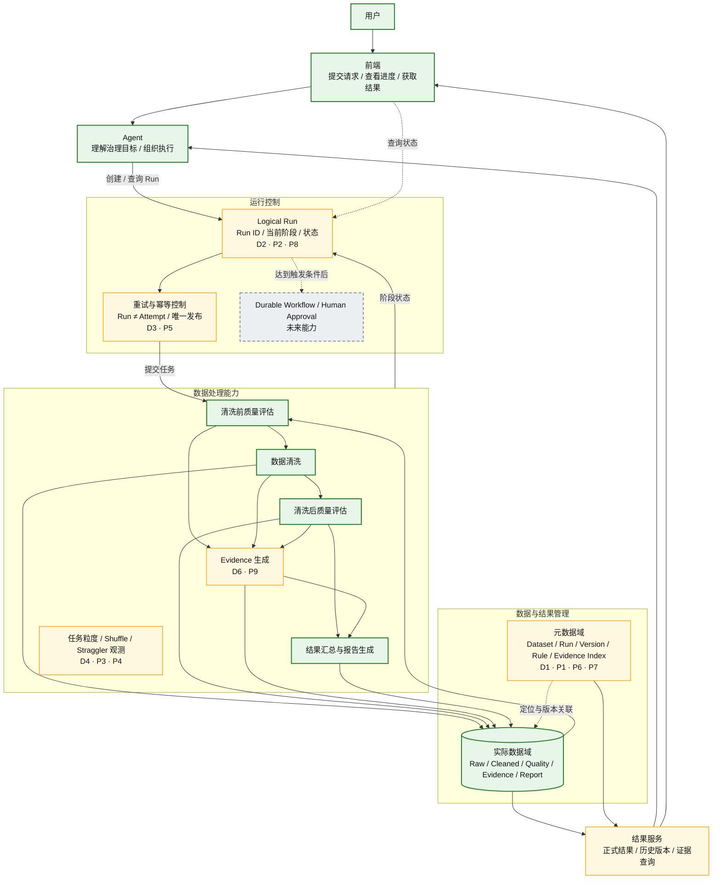
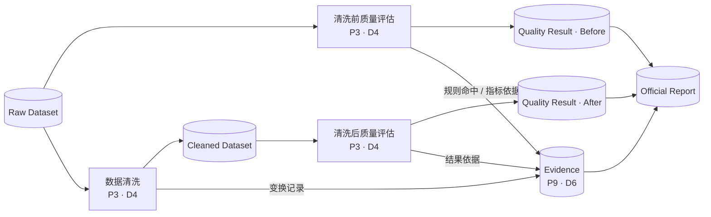
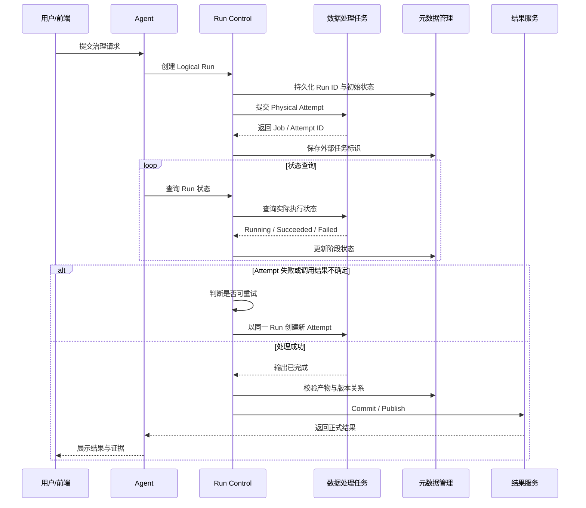
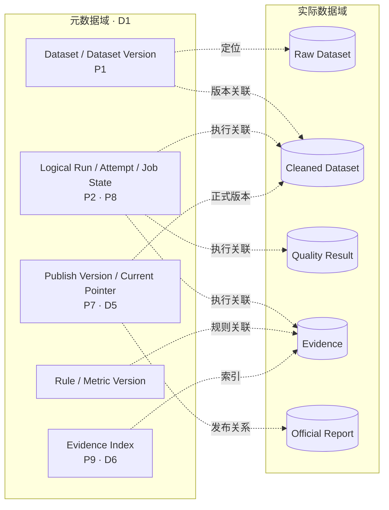

# 作业二：Google 三驾马车与 MovieLens 数据治理 Agent 架构设计

**课程主题：** 大数据分析  
**研究对象：** MovieLens 数据治理 Agent  
**组队序号：** ___9___  
**组队名：** ___BUG二改就队___

# 1. 系统场景与分析边界

MovieLens 数据治理 Agent 面向数据治理场景。用户通过前端提交自然语言请求，Agent 负责理解治理目标、组织执行步骤并调用数据处理能力；数据处理过程完成原始数据质量评估、数据清洗和清洗后的再次评估，最终由结果服务向用户提供质量结果、处理说明和报告。

系统的基本业务链路为：

```text
用户请求
  ↓
Agent 理解治理目标
  ↓
原始数据质量评估
  ↓
数据清洗
  ↓
清洗后质量评估
  ↓
证据与结果汇总
  ↓
正式结果与报告
```

本文关注的是该链路在存储、计算、数据组织、故障恢复和可信性方面的架构问题。分析对象不仅包括 Raw Dataset 和 Cleaned Dataset，还包括 Dataset Version、Rule、Metric、Logical Run、Physical Attempt、Evidence、Quality Result 和 Report 等业务对象。

本文的设计边界保持技术中立。需要明确的是系统在逻辑上应如何组织状态、版本、数据和恢复语义，以及后续技术选型必须提供哪些能力；具体数据库、文件系统、RowKey、索引、物理表结构、部署拓扑和产品组合不在本文中确定。

当前实验规模较小，因此不把超大规模系统能力直接视为当前必需项。对于只会在数据量、历史 Run 数、并发或外部系统数量显著增加后出现的问题，本文明确给出触发条件和重评条件，以避免为尚未出现的工作负载过度设计。

# 2. 工作负载与关键场景

## 2.1 当前工作负载

当前系统属于**用户触发、批处理为主、低并发的数据治理工作负载**。一次治理请求围绕一份 MovieLens 数据集展开，由 Agent 组织多个处理阶段，再由 Hadoop 执行数据扫描、聚合、清洗和质量计算。

一次完整 Run 可能产生以下对象：

- 输入侧：Raw Dataset、Dataset Version、Rule Version、Metric Version；
- 执行侧：Logical Run、Hadoop Job、Physical Attempt、阶段状态和运行日志；
- 输出侧：Cleaned Dataset、清洗前后 Quality Result、Evidence 和 Report；
- 管理侧：正式发布状态、历史版本关系和结果索引。

因此，系统的规模不能只用“原始数据有多少字节”衡量。随着重复运行和历史保留增加，**对象数量、版本数量、执行状态和证据数量**也会同步增长。

## 2.2 关键业务场景

### 2.2.1 正常治理链路

用户提交一次治理请求后，Agent 创建一个逻辑 Run，触发清洗前质量评估、数据清洗和清洗后质量评估，并基于真实结果生成解释和报告。该场景要求结果能够关联到确定的数据版本、规则版本和执行 Run。

### 2.2.2 失败与重试

Hadoop Task、Agent 进程或外部调用可能失败。底层计算允许 Retry，Agent 也可能因超时重新提交。该场景的关键不是“是否允许重试”，而是重试后能否避免重复产生正式 Dataset Version、Quality Result 或 Report。

### 2.2.3 历史结果查询与比较

随着同一 Dataset 被多次治理，用户需要查看不同 Run、不同 Rule 或不同 Dataset Version 的结果。此时查询对象从“当前结果”扩展为“历史版本关系”，需要明确什么是 `latest`、什么是正式结果、不同结果为何不同。

### 2.2.4 故障后的恢复

如果计算已经完成，但结果尚未发布；或者 Cleaned Dataset 已生成，而 Report 尚未生成，系统需要判断当前 Run 处于什么状态，并决定继续执行、重试局部阶段还是终止。物理文件仍然存在并不能自动证明业务 Run 已完整成功。

### 2.2.5 结果解释与审计

Agent 生成的解释必须能够回到真实执行证据。用户查看某个质量结论时，应能够追溯到对应 Rule、Source Record、Transformation、Run 和 Result，而不能只看到一段无法验证的自然语言说明。

## 2.3 未来工作负载变化

当系统从单次课程实验扩展为长期运行服务后，可能出现四类变化：数据集和历史版本增多、同一时间存在多个 Run、治理步骤和外部工具增加、结果保留周期变长。这些变化分别会放大元数据规模、任务调度与 Shuffle 成本、跨组件状态不一致以及历史查询成本。

因此，本文只把已经影响业务正确性的能力作为当前要求，例如 Run Identity、幂等发布、版本关联和 Evidence；高可用分布式元数据、多区域运行、百万级并发等能力仅作为达到明确触发条件后的未来设想。

# 3. 问题发现

## 3.1 P1：治理产物增长导致元数据规模先于存储容量成为扩展压力

MovieLens 数据治理任务并不是“一份输入对应一份输出”。一次完整运行可能产生原始数据、清洗数据、清洗前后质量结果、分区输出、中间文件、执行日志、证据和报告等多类对象。随着运行次数增加，系统中的逻辑文件和元数据对象数量可能比实际数据容量增长得更快。

**触发条件：** 数据集数量增加；同一数据集反复执行治理；长期保留历史结果；一个 Job 划分出大量 Map/Reduce 分区；中间结果和日志按 Run 或 Partition 独立保存。

**影响对象：** 存储元数据管理、历史结果查询、任务管理与运维。

**影响结果：** 文件创建、枚举、定位和恢复成本上升；历史任务查询逐渐变慢；系统可能在磁盘容量仍然充足时，先出现 namespace 和元数据管理压力。

**判断证据：** GFS 的 Master 将文件命名空间、文件到 Chunk 的映射等 Metadata 保存在内存中，并通过大 Chunk 降低 Master 需要管理的元数据数量。这说明“数据量”和“元数据量”是两个不同的扩展维度。

**优先级：** 中高。当前 MovieLens 实验规模下不会立即形成瓶颈，但数据组织粒度一旦固定，后期迁移成本较高，因此应在架构设计阶段提前定义对象边界。

---

## 3.2 P2：物理数据容错粒度与业务结果恢复粒度不一致

分布式存储能够保证某个数据块或文件在节点失效后仍然可用，但这并不等价于一次完整的数据治理运行可以恢复。对于本系统，一个有效结果实际上由 Cleaned Dataset、Quality Result、Evidence、Report 和 Run Metadata 等多个产物共同组成。

如果故障发生在这些产物生成或发布的中间阶段，系统可能出现“所有单独文件都合法存在，但组合起来不是一个完整业务结果”的状态。

**触发条件：** 节点或进程在文件写入、质量结果保存、证据持久化或报告发布阶段发生故障；计算已经完成但业务元数据尚未提交；部分产物成功而其他产物失败。

**影响对象：** 治理 Run、数据产物、结果服务、Agent 与最终用户。

**影响结果：** 产生孤立文件、缺失报告或逻辑不完整的 Run；任务状态与实际产物不一致；系统恢复后无法判断哪些产物属于同一次有效运行。

**判断证据：** GFS 的多副本机制解决的是 Chunk 的物理可靠性，而 MapReduce 还需要单独的 Task/Job Commit 过程才能判断结果是否正式生效。这表明“数据还在”与“业务结果已经完成”是两个不同层次的问题。

**优先级：** 高。该问题与数据规模无关，只要一次业务运行跨越多个阶段和产物，就可能发生。

---

## 3.3 P3：多阶段治理流程造成重复扫描、Shuffle 和中间数据的计算放大

MovieLens 数据治理流程至少包含清洗前评估、数据清洗和清洗后评估。如果五个质量维度进一步拆成多个独立计算任务，同一数据集可能被反复读取、排序、聚合和传输。

因此，系统总成本并不只由数据规模决定，还会受到 Pipeline 阶段数量影响。

**触发条件：** 五个质量维度分别执行独立 Job；清洗前后重复执行相同统计；多个指标都进行全表扫描；Unique、Consistency 等指标需要按照业务 Key 聚合。

**影响对象：** Hadoop 计算资源、网络带宽、任务完成时间与用户等待时间。

**影响结果：** 重复磁盘读取、Shuffle 网络流量和中间数据显著增加；当数据规模扩大后，运行时间可能随“数据规模 × Pipeline 阶段数”共同增长。

**判断证据：** MapReduce 的 Reduce 阶段需要从各个 Mapper 拉取中间结果并进行合并。若多个质量指标分别执行独立 MapReduce 阶段，同一份数据就会反复触发扫描和数据移动。

**优先级：** 中高。当前小数据量可以容忍，但它决定了后续扩展时系统能否有效利用分布式计算资源。

---

## 3.4 P4：数据均匀切分不能保证计算负载均匀

MapReduce 可以把输入文件划分为多个 Task，但输入大小相近不代表每个 Task 的实际工作量相同。数据质量计算往往需要按照 `movieId`、`userId` 等 Key 聚合，同一 Key 的记录最终会聚集到对应 Reducer。

一旦 Key 分布不均匀，少数 Partition 就可能明显大于其他 Partition。

**触发条件：** 质量计算按用户、电影等业务实体聚合；部分 Key 的数据量远高于平均水平；分区算法只依据 Key 而未考虑真实负载。

**影响对象：** Reduce Task、Worker 资源利用率、整体 Job 完成时间与 Agent 等待过程。

**影响结果：** 大部分 Worker 已空闲但整个 Job 仍需等待少数 Task；集群利用率下降；任务尾部出现明显 Straggler。

**判断证据：** MapReduce 的 Task Granularity 和 Backup Task 正是针对任务划分和 Straggler 问题提出的机制。但 Backup Task 只能缓解机器异常慢等问题，如果慢任务来自确定性的数据倾斜，再执行一次相同 Partition 不能从根本上减轻负载。

**优先级：** 中。当前应首先测量 Partition 大小与 Task 时长，在规模扩大后根据真实数据分布决定是否需要进一步处理。

---

## 3.5 P5：底层允许重复执行，而业务结果只能正式发布一次

分布式计算为了容错，会允许失败 Task 重新执行，也可能因为 Backup Task 或推测执行同时存在多个 Physical Attempt。对计算框架来说，这是正常的可靠性机制；但对业务层来说，同一次治理请求只能形成一个正式版本、一组质量结果和一份正式报告。

因此，系统存在“物理执行可以多次，业务结果必须唯一发布”的语义冲突。

**触发条件：** Task 自动 Retry；网络异常导致执行结果不确定；Agent 因超时再次提交；同一逻辑任务产生多个 Physical Attempt。

**影响对象：** Logical Run、Dataset Version、Quality Result、Report、任务状态与最终用户。

**影响结果：** 重复创建 Dataset Version；产生多份质量结果或报告；不同 Attempt 竞争更新 Run 状态；系统无法判断哪一次执行对应正式结果。

**判断证据：** MapReduce 将 Logical Task 与 Physical Attempt 区分，并通过 Commit 机制决定哪个 Attempt 的输出可以成为正式结果。这说明“一个业务请求”并不天然等于“一个物理执行”。

**优先级：** 高。只要存在 Retry 或调用超时，该问题就可能出现。

---

## 3.6 P6：数据物理布局与多种历史查询模式之间存在结构性矛盾

数据治理系统不仅要读取某次任务的结果，还可能需要查询：

- 某个 Dataset 的所有历史 Run；
- 某个 Rule 影响过哪些任务；
- 某个版本对应的报告；
- 某段时间内失败的任务；
- 某项质量指标对应的 Evidence。

不同查询按照不同字段定位数据，而一种物理布局通常只能天然优化其中一部分。

**触发条件：** 历史 Run 数量持续增加；系统支持跨 Dataset、Run、Rule、Version 和时间维度查询；存储结构只按照单一 ID 或写入顺序组织。

**影响对象：** 历史结果查询、报告服务、审计能力与前端交互。

**影响结果：** 原本简单的查询退化为大范围扫描；历史数据越多查询越慢；后期不断增加临时索引和重复数据，数据模型复杂度上升。

**判断证据：** Bigtable 的 Row Key、Tablet 和 Column Family 设计表明，数据物理布局必须结合访问模式设计；不匹配 Row Key 的查询需要付出更高扫描成本。

**优先级：** 中高。数据布局形成后再迁移历史数据成本较高，因此应在技术选型前明确核心查询模式。

---

## 3.7 P7：系统存在多条独立版本轴，单一 `version` 或 `latest` 无法准确表达结果

一个治理结果并不只受 Dataset Version 影响，还同时依赖 Cleaning Rule Version、Quality Metric Version、Agent/Prompt Version 和实际执行 Run。

因此系统实际上存在多条独立演进的版本轴。

例如：

```text
Dataset V1 + Rule V1 → Run A
Dataset V1 + Rule V2 → Run B
Dataset V2 + Rule V1 → Run C
```

仅使用 `version=3` 或 `latest` 无法解释这些结果之间的关系。

**触发条件：** 同一数据集使用新规则重新执行；输入数据升级而规则不变；程序或模型升级后重新运行；多个 Run 并发执行。

**影响对象：** Dataset、规则与指标版本、历史结果、报告和审计过程。

**影响结果：** 无法解释两个质量结果为何不同；历史比较失去意义；旧任务晚完成后可能覆盖新的正式结果；审计时无法还原结果产生条件。

**判断证据：** Bigtable 使用 Timestamp 为同一 Cell 保存多个历史版本，说明“覆盖旧值”并非唯一的数据组织方式。但本系统的版本变化来源更多，因此还需要显式区分 Dataset、Rule、Run 和 Publish Version。

**优先级：** 高。当前实验已经涉及数据版本、规则版本和任务标识，应在数据模型阶段明确版本关系。

---

## 3.8 P8：Agent、计算任务、数据输出和正式结果形成多个独立状态机

用户看到的是一个“数据治理任务”，但系统内部至少存在四类状态：

```text
Agent State
Hadoop Job State
Data Commit State
Report Publish State
```

这些状态不会在同一个事务中同时变化。

例如，Agent 提交 Hadoop Job 后发生网络超时，Agent 可能记录为 Failed，但 Hadoop 任务仍继续运行并最终成功。此时不同组件对同一次 Run 的判断发生分叉。

**触发条件：** Agent 调用超时；后台任务继续执行；计算成功但结果未 Commit；数据已 Commit 但报告生成失败；Agent 进程重启。

**影响对象：** Agent、Hadoop Job、数据提交状态、结果服务、前端与最终用户。

**影响结果：** 前端显示失败但后台仍在运行；Agent 重复提交任务；部分结果被误标为完整结果；用户无法判断当前结果是否可以正式使用。

**判断证据：** MapReduce 自身已经区分 Task State、Task Commit 和 Job Commit，说明即使在单一计算框架内部，“执行完成”和“结果正式生效”也不是同一状态。

**优先级：** 高。这是 Agent 调用异步数据处理任务后天然存在的跨组件一致性问题。

---

## 3.9 P9：缺少可追溯证据链时，Agent 的解释无法被验证

如果 Hadoop 最终只向 Agent 返回聚合数字，例如：

```text
Completeness = 92
Removed Rows = 231
```

但没有保存哪些输入记录触发了哪些规则、执行了什么变换、由哪个 Run 产生，那么 LLM 即使能够生成自然语言解释，也无法证明解释中的原因确实来自真实执行。

此时系统的“可解释”只是文本生成，而不是可验证的证据链。

**触发条件：** 只保存最终指标而不保存 Finding/Evidence；清洗程序只输出新数据而不记录变换过程；报告阶段只获得聚合数字；历史执行证据被覆盖。

**影响对象：** Agent、正式报告、审计人员、数据使用者与系统可信性。

**影响结果：** Agent 可能在正确数字基础上生成错误原因；用户无法追踪某项质量变化对应的原始记录；发生争议时无法复现清洗过程；正式报告缺乏审计依据。

**判断证据：** 现代数据血缘系统将 Dataset、Job、Run、Input、Output 等关系本身作为需要持久化的数据，说明结果产生过程不能依赖后期推测。

**优先级：** 高。本项目最终由 Agent 向用户解释治理结果，因此结果能否被证据验证属于核心正确性要求。

---

## 3.10 问题覆盖关系

| 类别 | 主要问题 | 核心矛盾 |
|---|---|---|
| 存储 | P1、P2 | 元数据规模与数据容量分别增长；物理数据可靠不等于业务结果可恢复 |
| 计算 | P3、P4、P5 | 多阶段计算放大；任务切分不等于负载均衡；重复执行与唯一发布冲突 |
| 数据组织 | P6、P7 | 单一布局无法支持所有查询；单一版本号无法描述多条版本轴 |
| 系统可信性 | P5、P7、P8、P9 | 多次执行、多组件状态、多版本结果与缺失证据共同影响最终结果可信性 |

这些问题共同指向一个核心现象：随着系统规模和历史运行次数增长，**存储边界、计算边界、版本边界、状态边界和证据边界开始彼此错位**。

---

# 4. 课堂知识与问题映射

Google 三驾马车分别从分布式文件存储、并行计算和结构化数据管理三个层面解决大规模系统问题。这里不把 GFS、MapReduce 或 Bigtable 直接视为技术方案，而是分析其设计机制，判断相同的系统性问题是否会在 MovieLens 数据治理 Agent 中出现。

总体映射如下：

| 课堂主题 | 代表机制 | 主要关联问题 |
|---|---|---|
| GFS | Single Master、Metadata、Chunk、Replica、Heartbeat、Operation Log、一致性模型 | P1、P2、P5、P8 |
| MapReduce | Task Granularity、Data Locality、Fault Tolerance、Retry、Backup Task | P3、P4、P5、P8 |
| Bigtable | Row Key、Tablet、Timestamp 多版本、MemTable、SSTable、Compaction、Bloom Filter | P2、P6、P7 |

## 4.1 GFS：从文件存储映射到治理系统的存储与恢复边界

### 4.1.1 Single Master 与集中式 Metadata

GFS 使用 Single Master 维护文件命名空间、文件到 Chunk 的映射、Chunk 副本位置等元数据，而实际数据存放在 ChunkServer。这样可以统一管理文件位置和副本，同时避免大规模数据直接经过 Master。

这种设计依赖“大文件、顺序写、流式读取、吞吐优先”的工作负载。较大的 Chunk 可以减少 Master 需要维护的映射数量和 Client 与 Master 的交互次数。

其代价是元数据集中化：当文件和 Chunk 数量不断增长时，Master 的内存和管理开销可能成为瓶颈。由此可以解释 P1——MovieLens Agent 的扩展压力不仅来自数据字节增长，还来自大量 Run、Version、中间产物和 Partition 对象带来的元数据放大。

**能力要求：** 后续技术选型需要明确元数据与大规模数据本体的职责边界，并评估大量 Dataset、Run、Version 和中间产物下的元数据扩展能力。

### 4.1.2 Replica、Heartbeat 与故障恢复

GFS 使用多副本保证 Chunk 在节点故障后仍然可用，并由 Master 通过 Heartbeat 掌握 ChunkServer 状态。

其核心假设是：在大规模廉价机器集群中，节点故障属于常态，因此系统必须持续检测并恢复。

这一机制可以解决物理数据块的可用性，但不能直接保证由多个业务对象共同组成的一次治理 Run 完整恢复。由此映射到 P2：Cleaned Dataset、Quality Result、Evidence、Report 和 Run Metadata 即使都分别保存成功，也仍可能因为提交边界不一致而无法组成一个有效业务结果。

**能力要求：** 除底层冗余外，还需要 Run 级别的完整性判断、恢复边界和正式发布条件。

### 4.1.3 Operation Log、Consistency Model 与自识别记录

GFS 的 Operation Log 记录关键元数据变化，并作为并发操作顺序的逻辑时间线；一致性模型则明确区分 Defined、Consistent、Undefined 和 Inconsistent 等状态。

这表明在并发写、追加和失败恢复场景下，系统不能简单假设“一次调用成功就等于一个全局事务完成”。GFS 进一步通过 Checkpoint、自校验记录和唯一标识帮助应用识别错误和重复。

这一思想与 P5、P8 直接相关：Agent 调用超时后重新提交，可能导致多个 Physical Attempt；不同组件也可能对同一次 Run 持有不同状态。

**能力要求：** 每个 Logical Run 需要稳定标识；关键状态变化需要可持久化；系统必须能够识别重复执行并恢复执行状态。

---

## 4.2 MapReduce：从并行计算映射到任务切分、数据移动与执行语义

### 4.2.1 Task Granularity

MapReduce 将 Map 阶段划分为 M 个任务、Reduce 阶段划分为 R 个任务，通过大量相对独立的 Task 获得并行执行和动态负载均衡能力。

但是 Task 不能无限细分。任务过少会降低并行度，任务过多则会增加调度状态、中间结果和 Master 的管理开销。与此同时，Task 数量相等并不意味着实际工作量相同。

这一机制分别对应 P3 与 P4。五维质量评估如果被拆成大量独立任务，会增加调度与中间数据成本；而按 `movieId`、`userId` 聚合时，不同 Key 的数据分布又可能导致某些 Partition 远重于其他 Partition。

**能力要求：** 系统需要记录 Partition 数据量、Task 时长和 Shuffle 量，并根据真实工作负载调整计算粒度。

### 4.2.2 Data Locality

MapReduce 尽量把 Map Task 调度到保存相应输入数据的节点，以减少大规模输入在网络中的搬移。

这一机制说明“数据移动”本身是一项重要成本。但 Data Locality 只能降低 Map 输入阶段的传输，并不能消除 Reduce Shuffle。

对于 MovieLens Agent，这对应 P3。即使每个独立 Job 都具有较好的数据本地性，如果业务 Pipeline 仍按照“质量评估 → 清洗 → 再评估”反复启动全量任务，同一数据仍会被多次扫描和跨节点传输。

**能力要求：** 后续需要判断哪些质量指标可以共用一次扫描、哪些中间结果值得复用、哪些阶段必须 Shuffle。

### 4.2.3 Fault Tolerance、Retry 与 Backup Task

MapReduce 通过重新调度失败 Task 实现容错。Task 具有 `idle / in-progress / completed` 等状态；Worker 失败后，任务可以重新回到 Idle 并被其他 Worker 执行。对于少数异常缓慢的 Straggler，系统还可以启动 Backup Task。

这些机制依赖一个重要前提：同一个逻辑 Task 应当能够安全重复执行。

在 MovieLens Agent 中，这一前提与业务层产生冲突。Hadoop 可以重新执行一个 Task，但 Dataset Version、Quality Result 和 Report 通常只能正式发布一次，因此形成 P5；同时 Agent、Hadoop 与结果发布状态可能发生分叉，形成 P8。

**能力要求：** 系统应区分 Logical Run 与 Physical Attempt，并使正式业务副作用具备幂等性和唯一发布语义。

---

## 4.3 Bigtable：从结构化数据管理映射到查询和版本组织

### 4.3.1 Row Key、Column Family 与 Tablet

Bigtable 将数据组织为 `(Row, Column, Timestamp) → Value` 的多维稀疏映射，相邻 Row Key 被组织为 Tablet，Column 则进一步按 Column Family 分组。

这种设计的核心是：数据布局需要服务主要访问模式，而不是追求对所有查询都同样高效。

这对应 P6。MovieLens 数据治理系统既需要按 Dataset、Run、Version 查询，也可能需要按 Rule、时间和 Evidence 查询。单一物理布局不能同时优化所有访问模式。

**能力要求：** 在具体设计 RowKey、索引和分区之前，必须先明确最重要的查询模式和性能优先级。

### 4.3.2 Timestamp 多版本

Bigtable 的一个 Cell 可以保存多个 Timestamp 版本，并按时间倒序访问，从而避免简单覆盖历史值。

这一机制可以解释 P7：保留历史结果是必要的，但本系统的版本并不只有“时间”一个维度。Dataset Version、Rule Version、Metric Version、Run 和 Publish Version 需要分别建模。

**能力要求：** 历史结果不可被简单覆盖；需要显式记录各版本之间的来源和依赖关系。

### 4.3.3 MemTable、SSTable、Compaction 与 Bloom Filter

Bigtable 通过 MemTable 接收近期写入，通过不可变 SSTable 保存历史数据，并利用 Compaction 整理存储结构、利用 Bloom Filter 减少无效磁盘读取。

这一设计揭示了另一个基本权衡：持续追加和保留历史值虽然有利于写入和追溯，却会增加后续读取与整理成本。

这与 P6 相呼应。随着 Dataset Version、Run、Evidence 和 Report 持续积累，系统必须同时考虑历史保留、查询效率和数据整理成本。

**能力要求：** 需要明确正式结果、历史结果和中间结果的保留策略，以及长期历史数据的整理和清理机制。

---

## 4.4 课堂知识映射结论

GFS、MapReduce 和 Bigtable 所解决的问题并不是本系统的现成技术答案，而是提供了分析问题的机制视角：

- **GFS** 强调存储容量之外还存在元数据规模、故障边界和一致性问题；
- **MapReduce** 强调并行计算之外还存在任务粒度、数据移动、重试和重复执行问题；
- **Bigtable** 强调结构化存储之外还存在访问模式、历史版本和读写放大的权衡。

P9“证据不可追溯”没有被三驾马车中的单一机制完整解决。三者能够提供日志、历史版本和运行记录等基础能力，但 `Evidence → Rule → Transformation → Result → Report` 的业务证据链仍需要在 MovieLens 数据治理 Agent 上层单独建立。

---

# 5. 工业界演进调研：Durable Agent Workflow

## 5.1 演进背景

传统 MapReduce 主要解决“大规模计算任务在机器故障后如何重新执行”。但现代 Agent 工作负载已经从单个计算 Job 演进为跨越模型推理、外部工具、异步计算、状态持久化和人工确认的长生命周期流程。

传统同步 Agent 往往采用：

```text
用户请求
  ↓
Agent 推理
  ↓
调用工具
  ↓
等待结果
  ↓
返回用户
```

对于几秒内完成的简单任务，这种模式足够。但 MovieLens 数据治理 Agent 的一次业务运行可能包括：

```text
LLM 推理
  ↓
提交 Hadoop Job
  ↓
等待后台计算
  ↓
保存质量结果
  ↓
生成 Evidence
  ↓
发布 Report
```

任何一个阶段发生网络超时、进程退出或节点故障，都可能导致 Agent 不知道“任务没有执行”还是“任务已经执行，但确认信息丢失”。

因此，当前业界逐渐将复杂 Agent 从同步调用模式演进为 **Durable Agent Workflow**：一次用户请求首先形成一个长期存在的 Logical Run，系统持久化执行状态和关键事件，并允许任务在进程退出、网络故障或人工等待后继续恢复。

代表性实践包括 Temporal 的 Durable Execution、Airflow 对可重试任务状态和外部 Job ID 的持久化，以及 OpenLineage 对 Run、Job、Dataset 生命周期的显式建模。[4][5][6]

---

## 5.2 经典方案原本解决的问题

MapReduce 的经典容错模型关注的是单个计算 Job 内部：

- Worker 失效后重新调度 Task；
- 通过数据本地性降低网络传输；
- 通过 Backup Task 缓解 Straggler；
- 通过 Task/Job Commit 判断计算结果是否生效。

这种机制能够回答：

> “某个计算 Task 是否完成？”

但现代 Agent 系统还需要回答：

> “用户提交的整个业务请求是否完成？”

后者可能同时涉及 Agent State、Hadoop Job、Dataset Version、Evidence 和 Report，因此已经超出了单个 MapReduce Job 的事务边界。

---

## 5.3 工作负载发生的变化

### 5.3.1 从短请求变成长生命周期任务

传统 Web 请求通常在几十毫秒到数秒内完成，而 Agent 工作流可能因为异步数据处理、人工审批或外部服务等待持续数分钟甚至更久。

这意味着系统不能再假设：

> 一个进程必须从任务开始一直存活到结束。

Durable Execution 的核心是将 Run State 和 Event History 持久化，使任务可以在 Worker 重启后继续恢复，而不是从第一步重新执行。

### 5.3.2 从确定性计算变成带副作用的跨系统执行

MapReduce 中理想的 Task 接近：

```text
Input → Function → Output
```

重复执行通常能够得到等价结果。

Agent Workflow 的步骤却可能包含：

- 创建 Dataset Version；
- 写数据库状态；
- 提交 Hadoop Job；
- 发布 Report；
- 发送通知。

这些操作都具有外部副作用。

如果调用成功但响应丢失，Agent 无法仅凭一次 Timeout 判断副作用是否已经发生。直接 Retry 可能产生重复版本或重复发布，因此现代工作流越来越强调 **Retry 与 Idempotency 必须一起设计**。

### 5.3.3 从一个状态变成多个组件共同维护状态

同一个业务 Run 可能同时存在：

```text
Agent State
Hadoop Job State
Data Commit State
Report Publish State
```

这些状态会在不同时间变化。单个组件的 SUCCESS 不能代表业务整体完成。

因此工业界开始将执行状态本身作为需要持久化的数据，并通过 Stable Run ID、External Job ID、Checkpoint 和 Event History 把多个局部状态重新关联起来。

### 5.3.4 Agent 引入概率性决策和人工确认

传统 Pipeline 的执行逻辑主要由固定程序定义，而 Agent 可能根据自然语言和 LLM 判断选择不同清洗动作。

对于“删除大量异常记录”“覆盖正式结果”等高风险操作，全自动执行的风险较高，因此 Durable Agent Workflow 往往进一步支持 Human-in-the-loop：

```text
Agent 提出操作
  ↓
Workflow 暂停
  ↓
人工确认
  ↓
继续执行或终止
```

这使 Workflow 不再只是“任务调度器”，而是长期业务过程的状态承载体。

---

## 5.4 新路线解决的旧问题

Durable Agent Workflow 可以通过以下能力缓解本系统问题：

**Stable Run Identity：** 一次用户请求先形成稳定的 Logical Run。后续 Agent、Hadoop Job、Dataset、Quality Result、Evidence 和 Report 都关联同一个 Run，从而避免把某次进程或某个 Attempt 当成业务任务本身。

**Durable State / Event History：** 系统不只保存一个 `RUNNING/FAILED` 字段，而是保存任务从创建、提交、执行、Commit 到 Publish 的关键事件，使进程退出后仍能恢复真实状态。

**Retry + Idempotency：** Retry 可以继续存在，但重复 Attempt 不能产生多个正式业务结果。一个 Logical Run 可以拥有多个 Physical Attempt，但最终只能形成一个正式发布结果。

**Checkpoint / Resume：** 若流程在“清洗后质量评估”阶段失败，可以从已完成的前序阶段继续，而不是重新执行整条链路。

**Lineage / Evidence：** 将 Input Dataset、Rule、Run、Output Dataset、Evidence 和 Report 显式关联，使自然语言解释建立在真实执行证据之上，而不是事后推测。

这条路线直接对应 P2、P5、P8、P9，并部分支撑 P7。

---

## 5.5 新路线引入的新问题

Durable Agent Workflow 并不是免费的可靠性能力。

首先，系统复杂度明显上升。原来的 `Agent → Hadoop` 会扩展为 `Agent → Workflow → Activity → Hadoop → State/Event History`，需要额外处理 Timeout、Retry、Cancel、Resume 和 Workflow State。

其次，Durable Execution 并不等于 Exactly Once。外部数据库写入、文件发布和通知仍然需要业务自己设计幂等键、唯一约束或去重逻辑。

再次，LLM Call、外部 API 和 Hadoop Submit 等行为具有不确定性或副作用，不能与可重放的 Workflow State 混为一体，需要明确 Orchestration 与 Activity 的边界。

最后，Event History、Run Metadata 和 Lineage 本身也会持续增长，意味着 Durable Workflow 会进一步加强 P1 中的元数据管理要求。

---

## 5.6 对 MovieLens 数据治理 Agent 的适用结论

当前项目并不需要直接复制生产级 Workflow 平台的全部复杂度，但以下能力已经适用于本系统：

1. 每次用户请求具有稳定 Logical Run ID；
2. Hadoop Job ID 必须持久化，而不能只存在于 Agent 当前调用栈；
3. 任务状态能够跨进程恢复；
4. Retry 与幂等性一起设计；
5. Logical Run 与 Physical Attempt 分离；
6. 正式结果需要显式 Commit/Publish；
7. Dataset、Rule、Run、Evidence、Report 建立可追溯关系；
8. 为高风险 Agent 动作保留人工确认扩展点。

而多区域 Workflow Runtime、百万级并发 Agent、多租户公平调度等能力属于更大规模的生产场景，目前没有工作负载证据支持引入。

因此，本系统应吸收 Durable Execution 的设计思想，而不是直接复制生产级平台复杂度。

---

# 6. 架构设计决策

设计决策采用技术中立方式描述系统“逻辑上必须做什么”。具体文件系统、数据库、表结构、RowKey、消息系统或 Workflow 产品由后续技术选型确定。

## 6.1 D1：元数据管理与大规模数据本体在逻辑上分离

**关联问题：** P1、P6、P7

**设计决策：** 系统将 Dataset、Run、Version、Rule、Evidence 索引和结果发布状态视为元数据对象，与 Raw/Cleaned Dataset、批量中间结果等大数据本体分离管理。业务查询首先通过元数据定位目标对象，再访问对应数据，而不是依赖遍历数据目录推断业务状态。

**所需能力：**

- 独立记录 Dataset、Run、Version 和 Rule 标识；
- 元数据对象可以快速按 ID 和主要业务条件检索；
- 大数据文件不需要承载复杂业务状态；
- 能够控制中间结果和小文件数量；
- 元数据增长与数据容量增长可以分别监测。

**约束：** 当前课程实验规模较小，不要求部署复杂的分布式元数据服务；设计重点是明确职责边界，而不是增加不必要组件。

**依据：** GFS 将 Master Metadata 与 Chunk Data 分离；Bigtable 的 Row Key 与 Tablet 说明数据位置和访问方式需要显式组织。P1、P6、P7 表明，本系统后续主要复杂度来自 Dataset、Run、Rule、Version 等关系，而不是单个文件本身。

**代价与保留风险：** 元数据与大数据本体分离后，需要维护二者的一致性。元数据记录存在而实际数据缺失，或实际数据已经生成但元数据尚未提交，都需要额外处理。

**验收条件：**

- 任一正式结果都能通过元数据唯一定位到对应 Dataset、Run 和 Version；
- 查询某次 Run 不需要扫描全部历史文件；
- 删除或清理中间数据时不会破坏正式元数据关系。

**触发重评的条件：** 当历史 Run 数量、Dataset 数量或查询模式大幅增长，当前元数据模型无法支撑低成本定位时，应重新评估元数据的存储与分区方案。

---

## 6.2 D2：以 Logical Run 作为业务恢复和状态管理的基本单位

**关联问题：** P2、P5、P8

**设计决策：** 用户每次发起数据治理请求时创建唯一 Logical Run。Agent State、Hadoop Job、Physical Attempt、Dataset Output、Quality Result 和 Report 都必须关联到该 Run。业务完成状态由 Run 统一判断，而不能直接采用某个组件的 SUCCESS 作为整体完成依据。

**所需能力：**

- 全局唯一 Run ID；
- Run 与 Physical Attempt 一对多关联；
- Run 状态可跨进程持久化；
- 保存外部 Hadoop Job ID；
- 支持失败恢复、重新查询和继续执行；
- 明确 Run 的状态迁移规则。

**约束：** 当前阶段只需要支持课程实验中实际出现的关键状态，不追求复杂企业级状态机。

**依据：** MapReduce 已经区分 Logical Task 与 Attempt；Durable Workflow 进一步把一次业务请求建模为长期存在的 Run。P2 和 P8 表明，本系统不能用单个文件或单个 Hadoop Job 代表整个治理任务。

**代价与保留风险：** 需要维护更复杂的状态迁移；若不同组件状态更新时序不同，仍可能短暂出现不一致，因此需要明确最终状态判定规则。

**验收条件：**

- Agent 进程退出后重新启动，仍能通过 Run ID 恢复 Hadoop Job 和当前阶段；
- Hadoop Job 成功但 Report 失败时，Run 不会被误标为完整成功；
- 任一 Physical Attempt 都能追溯到所属 Logical Run。

**触发重评的条件：** 当 Workflow 跨越更多外部系统、出现长时间等待或人工审批时，应重新评估是否需要更完整的 Durable Workflow Runtime。

---

## 6.3 D3：所有可重试操作必须满足幂等或可去重，正式结果采用唯一发布语义

**关联问题：** P5、P8

**设计决策：** 系统接受底层任务可能被重复执行，但不允许同一 Logical Run 因多个 Attempt 产生多个正式业务结果。所有具有外部副作用的操作必须具备幂等键、唯一约束、去重机制或显式 Commit/Publish 过程。

**所需能力：**

- Run 级 Idempotency Key；
- Physical Attempt 独立标识；
- 重复提交检测；
- 正式结果唯一 Commit/Publish；
- 失败 Attempt 不能覆盖成功结果；
- 已发布结果默认不可被普通重试覆盖。

**约束：** 不要求实现理论上的分布式 Exactly Once；目标是在业务层实现“重复执行可接受、重复正式发布不可接受”。

**依据：** MapReduce Retry 和 Backup Task 都说明一次逻辑任务可能对应多个物理执行；Durable Workflow 也普遍采用 At-least-once + Idempotency 的方式保证可靠执行。

**代价与保留风险：** 幂等键和唯一约束需要业务定义；对于无法天然幂等的外部操作，仍需补偿或人工处理。

**验收条件：**

- 相同 Run 被重复提交或 Retry 时，不会产生多个正式 Dataset Version；
- 多个 Attempt 并发结束时，只能有一个结果获得正式发布资格；
- 重试不会重复生成正式 Report 或重复通知。

**触发重评的条件：** 当系统引入无法幂等的外部服务或跨系统强一致事务需求时，应重新评估补偿事务或更强一致性机制。

---

## 6.4 D4：计算流程以减少重复扫描和数据移动为目标，并允许根据工作负载调整任务粒度

**关联问题：** P3、P4

**设计决策：** 五维质量评估和清洗流程不默认“一项指标一个独立 Job”。能够共用输入扫描和中间统计的指标应尽量合并；需要 Shuffle 的计算应明确其必要性。任务划分方式应结合 Partition 数据量和真实 Task 时长动态评估，而不是只依据固定并行度。

**所需能力：**

- 记录每阶段输入量、输出量和 Shuffle 量；
- 记录每个 Task/Partition 的运行时间；
- 可复用中间统计结果；
- 可调整 Map/Reduce 粒度；
- 能识别数据倾斜与普通机器 Straggler 的差异。

**约束：** 当前实验数据规模较小，不以极限性能为目标；重点是避免形成明显不合理的重复全表扫描和不必要 Shuffle。

**依据：** MapReduce 的 Data Locality、Task Granularity 和 Backup Task 都体现了“并行度、数据移动和调度成本之间存在权衡”。P3 和 P4 表明，本系统真正需要优化的是业务 Pipeline 的数据流，而不是单纯增加 Worker。

**代价与保留风险：** 合并多个指标计算会提高单个 Job 的复杂度；复用中间结果也会增加缓存和中间数据管理成本。

**验收条件：**

- 能说明每个主要 Job 是否需要全量扫描和 Shuffle；
- 清洗前后重复计算中，可识别并复用不依赖清洗结果的统计；
- 当某个 Partition 明显成为长尾时，能够通过监控定位原因。

**触发重评的条件：** 当数据规模扩大到当前方案无法满足课程或业务时延目标时，应重新评估 DAG 化执行、批流统一或存算分离等更复杂计算模型。

---

## 6.5 D5：版本关系显式建模，正式结果不可由“最后完成时间”决定

**关联问题：** P6、P7、P9

**设计决策：** Dataset Version、Rule Version、Metric Version、Run 和 Publish Version 分别建模，并记录它们之间的关联。正式结果通过明确 Publish 操作产生，而不是简单将“最后完成的 Run”设为 `latest`。

**所需能力：**

- Dataset Version 独立标识；
- Rule/Metric Version 独立标识；
- Run 与各版本关系可查询；
- 历史正式结果默认不可变；
- 显式 Publish/Current 指针；
- 支持历史版本比较和回溯。

**约束：** 当前阶段不要求支持任意复杂的时间旅行查询，但必须能够还原任一正式报告所对应的数据、规则和运行条件。

**依据：** Bigtable 的 Timestamp 多版本说明历史值不应简单覆盖；P7 表明本系统存在多条独立版本轴，仅依赖一个 `version` 或 `latest` 字段会产生语义歧义。

**代价与保留风险：** 多版本会增加存储与查询复杂度，需要后续制定历史保留和垃圾回收策略。

**验收条件：**

- 任一 Report 可以唯一追溯到 Dataset Version、Rule Version、Metric Version 和 Run；
- 较旧 Run 晚完成时不会自动覆盖新的正式结果；
- 同一 Dataset 使用不同规则重跑后，两次结果可以并存和比较。

**触发重评的条件：** 当版本数量导致查询或存储成本显著上升时，应重新评估版本保留、归档和物理布局策略。

---

## 6.6 D6：Evidence 作为一等数据持久化，Agent 只基于可追溯证据生成正式解释

**关联问题：** P9，并关联 P7、P8

**设计决策：** 数据质量规则命中、原始记录引用、变换动作、执行 Run 和最终指标之间的关系必须在执行过程中形成并持久化。Agent 的正式解释只能引用这些已存在的 Evidence，而不能仅根据聚合分数自由推断原因。

**所需能力：**

- Evidence 独立标识；
- Evidence 与 Source Record、Rule、Run、Transformation、Metric 建立关联；
- Report 可引用 Evidence；
- Evidence 能随正式结果长期保留；
- 支持从 Report 反查原始证据。

**约束：** 不要求保存所有中间计算细节；应保存足以解释和复现正式质量结论的关键证据。

**依据：** OpenLineage 等现代数据血缘模型将 Run、Job、Input Dataset、Output Dataset 的关系作为一等数据。P9 表明，仅有最终分数无法保证 Agent 解释可靠。

**代价与保留风险：** Evidence 会增加元数据和存储量，并可能包含大量记录级信息，需要在完整性与成本之间平衡。

**验收条件：**

- 任一正式质量结论都能找到对应 Evidence；
- Report 中的主要原因能够从 Evidence 反向验证；
- Agent 无法在没有 Evidence 的情况下把推测性原因标记为正式事实。

**触发重评的条件：** 当记录级 Evidence 数量显著影响存储和查询性能时，应重新评估证据粒度、聚合方式和保留策略。

---

# 7. 逻辑架构

本节使用四个互补视图描述同一逻辑架构。所有图均保持技术中立，不绑定具体数据库、文件系统或 Workflow 产品。

**统一图例：**

- 绿色节点：当前实验已有或必须存在的基础处理链；
- 黄色节点：本文形成的设计要求；
- 灰色虚线节点：达到触发条件后的未来能力；
- `P*`：问题编号；
- `D*`：设计决策编号。

## 7.1 总体架构图

总体架构图用于说明用户、前端、Agent、运行控制、数据处理、数据与元数据管理以及结果服务之间的职责关系。



总体上，用户请求首先进入 Agent，但真正跨阶段存在的业务身份是 Logical Run。数据处理能力负责计算，Run Control 负责状态和恢复语义；元数据域负责定位 Dataset、Version、Rule、Run 与 Evidence，实际数据域负责保存 Raw Dataset、Cleaned Dataset、Quality Result、Evidence 和 Report。结果服务只暴露已经能够被定位和解释的结果。

## 7.2 数据流

数据流视图强调 Raw Dataset、Cleaned Dataset、Quality Result、Evidence 和 Report 之间的来源关系，并标出多阶段扫描与证据生成发生的位置。



该视图对应 P3 与 P9。P3 关注同一数据在多阶段治理中的重复扫描和 Shuffle 放大，因此 D4 要求后续实现能够观测并减少不必要的数据移动；P9 关注解释可信性，因此 D6 要求 Evidence 在处理过程中产生，而不是在报告阶段由 Agent 临时推测。

## 7.3 控制流

控制流视图描述 Agent 提交任务、查询状态、处理 Retry 以及发布正式结果的过程，重点解决 P5 和 P8。



Logical Run 与 Physical Attempt 被明确分离。Retry 可以产生新的 Attempt，但不能产生新的业务身份；只有满足完整性和版本约束的结果才进入 Commit/Publish。这样可以避免“Agent 超时但后台已成功”“多个 Attempt 同时结束”“某个局部组件 SUCCESS 就代表整体成功”等状态错误。

## 7.4 元数据与实际数据边界

该视图用于说明 D1 的职责边界以及 D5、D6 如何在元数据域中保存版本和证据关系。



元数据域不保存大规模数据本体，而负责回答“这是什么数据”“由哪个 Run 产生”“使用了哪个规则版本”“哪个结果是正式结果”“证据在哪里”等问题。实际数据域保存真正的数据与结果文件。二者逻辑分离后，系统能够独立处理 P1 的元数据增长、P6 的历史查询、P7 的多版本关系和 P9 的证据追溯问题。

# 8. 分阶段演进

## 8.1 阶段一：保证当前实验链路可信

该阶段面向当前 MovieLens 实验，优先保证业务链路可信，不引入与当前工作负载不匹配的大型基础设施。

重点包括：

- 建立 Logical Run ID；
- 持久化 Hadoop Job ID；
- 区分 Run 与 Attempt；
- 明确结果 Commit/Publish 条件；
- 保存 Dataset、Rule、Run、Report 基本版本关系；
- 为正式质量结果保留 Evidence。

该阶段主要落实 D2、D3、D5、D6。

## 8.2 阶段二：改善计算与历史数据组织

随着数据量和历史 Run 增长，重点转向：

- 合并重复全表扫描；
- 测量并优化 Shuffle；
- 监测 Partition 倾斜和 Straggler；
- 明确主要查询模式；
- 优化 Metadata 与大数据本体的组织方式；
- 制定历史结果和中间数据的保留策略。

该阶段主要落实 D1、D4，并进一步完善 D5。

## 8.3 阶段三：达到触发条件后再引入更强的分布式能力

只有在真实工作负载出现以下变化后，才重新评估更复杂方案：

- 单一元数据服务出现容量或吞吐瓶颈；
- 历史版本规模使查询明显退化；
- 单机或当前 Hadoop 配置无法满足处理时延；
- Agent Workflow 需要长时间等待、人工审批或跨多个外部系统；
- 高可用和跨节点恢复成为正式运行要求。

此时再比较高可用/分布式元数据、不同历史存储模型、DAG 执行、存算分离或完整 Durable Workflow Runtime 等具体技术。

---

# 9. 风险、限制与重评条件

本文的设计解决的是业务边界和能力要求，并不能消除所有分布式系统风险。主要限制如下。

| 风险或限制 | 当前处理方式 | 需要重评的条件 |
|---|---|---|
| 元数据持续增长 | 控制对象粒度，分离元数据与数据本体 | Dataset、Run、Evidence 数量使当前元数据查询或恢复明显退化 |
| Run 状态仍可能短暂不一致 | 持久化外部 Job ID，以 Logical Run 聚合状态 | Workflow 跨越更多外部系统、人工审批或长时间等待 |
| 幂等不等于 Exactly Once | 使用 Idempotency Key、唯一发布和去重 | 引入无法幂等的外部副作用或跨系统强一致事务 |
| Evidence 增加存储与查询成本 | 只保存足以解释正式结论的关键证据 | 记录级 Evidence 数量成为主要成本或查询瓶颈 |
| 多版本提高可追溯性但增加历史成本 | 正式结果不可变，显式维护 Publish/Current 关系 | 历史版本规模影响存储、查询或归档成本 |
| 计算优化依赖真实数据分布 | 监测 Partition、Task 时长和 Shuffle | 出现持续数据倾斜、明显长尾或时延目标无法满足 |
| Durable Workflow 增加系统复杂度 | 当前只吸收 Run、Retry、Resume、Idempotency 等原则 | 长生命周期、多步骤、多系统编排成为常态 |
| 当前规模不足以验证超大规模瓶颈 | 对未来问题只给出触发条件，不提前实现复杂方案 | 实际容量、吞吐、并发或可用性要求跨过现有边界 |

因此，后续技术选型不应只比较产品特性，而应以 P1～P9、D1～D6 以及本节的触发条件为约束，验证候选方案是否真正匹配当前工作负载。

# 10. 结论

MovieLens 数据治理 Agent 的架构问题并不只来自数据量增长。随着治理任务被重复执行并保留历史结果，系统同时面临元数据增长、计算与 I/O 放大、任务长尾、重复执行、多版本关系、跨组件状态不一致以及结果证据不可追溯等问题。

GFS、MapReduce 和 Bigtable 提供了三个互补的分析视角：GFS 说明物理存储可靠性之外还存在元数据和一致性边界；MapReduce 说明并行执行之外还必须处理任务粒度、数据移动、Retry 和 Attempt；Bigtable 说明数据组织必须围绕访问模式和历史版本设计。工业界的 Durable Agent Workflow 则进一步说明，当 Agent 开始编排长时间、跨系统并带副作用的任务后，Logical Run、持久状态、幂等执行和可追溯证据会成为业务可靠性的核心。

基于这些问题和机制，本文形成 D1～D6 六项技术中立设计决策：分离元数据与数据本体、以 Logical Run 统一业务恢复、为可重试操作建立幂等与唯一发布语义、减少重复扫描和无效数据移动、显式建模多条版本轴，并把 Evidence 作为正式解释的基础数据。

这些决策不提前绑定具体技术产品。后续技术选型应围绕存储、计算、查询、恢复、版本和可信性能力逐项验证，并在实际工作负载达到本文定义的重评条件后再引入更复杂的分布式能力。

# 参考资料

[1] Sanjay Ghemawat, Howard Gobioff, Shun-Tak Leung. *The Google File System*. SOSP, 2003.  
https://research.google/pubs/the-google-file-system/

[2] Jeffrey Dean, Sanjay Ghemawat. *MapReduce: Simplified Data Processing on Large Clusters*. OSDI, 2004.  
https://research.google/pubs/mapreduce-simplified-data-processing-on-large-clusters/

[3] Fay Chang et al. *Bigtable: A Distributed Storage System for Structured Data*. OSDI, 2006 / ACM TOCS, 2008.

[4] Temporal Documentation. *Durable Execution / AI Workflows*.  
https://docs.temporal.io/

[5] Apache Airflow Documentation. *Best Practices / Task and State Management*.  
https://airflow.apache.org/docs/apache-airflow/stable/

[6] OpenLineage Documentation. *Run Cycle, Job and Dataset Lineage*.  
https://openlineage.io/docs/

[7] 课程课件：《Google 三驾马车》，大数据分析课程。
