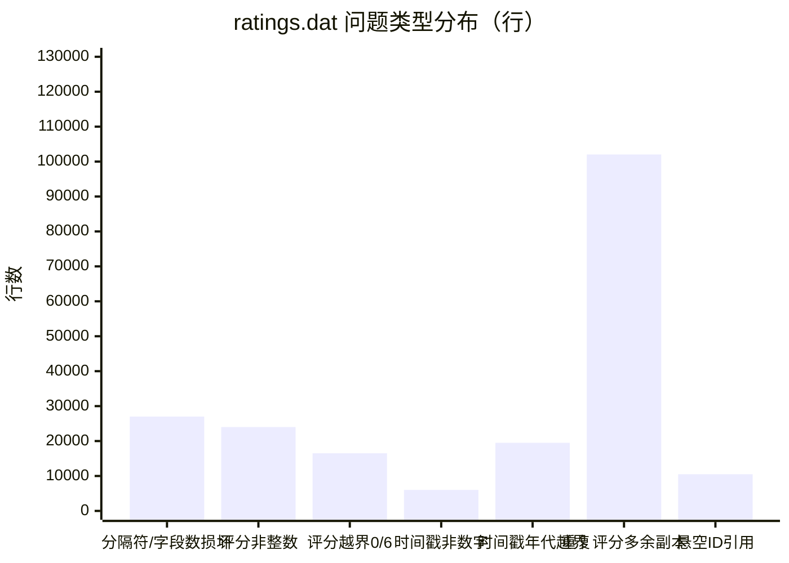

# Agent 驱动的 Hadoop 数据清洗与五维质量评估

**数据集：MovieLens 1M · 规则版本 rules-v2.0 · 运行环境：容器内真实 Hadoop MapReduce（Hadoop 3.3.6）**

---

## 一、系统是怎么设计的

用户输入一句自然语言，Agent 调度容器内真实的 Hadoop MapReduce 完成清洗与评分，并用报告实测数字向用户解释。


三栏前端各回答一个问题：

- **左栏（执行）**：六步工作流实时点亮，每步对应真实的 MapReduce 作业；"当前任务"卡显示任务 ID、数据指纹、规则版本、T1/T2 与运行时长
- **中栏（交互）**：自然语言任务进、Agent 解释出，任务内可继续追问
- **右栏（结果）**：五维评分对比、数据量变化、问题处置分色统计、数据样例、评估报告下载、局限声明常驻

设计原则：**Hadoop 负责计算，Agent 负责解释**；所有分数、计数、版本号必须来自报告实测字段；会话持久化，历史任务可回放。

---

## 二、发现了数据哪些问题

清洗前对原始数据实测探查（`explore_data.py`，统计结果即下表）。ratings 表问题量级（行数）：



### 2.1 ratings.dat（1,150,241 行）

| 问题 | 实测规模 | 判定 |
| --- | --- | --- |
| 分隔符/字段数损坏 | 27,006 行：多余字段（`5::1722::2::978246108::EXTRA_FIELD`）、字段缺失（`17::::4::…`）、逗号行（`25,688,4,978133460`） | 错误：可还原→修复，缺失→隔离 |
| 评分非整数 | 24,005 行（如 `3.5`） | 错误：四舍五入属编造数据→隔离 |
| 评分越界（0 或 6） | 16,504 行（值分布 0:8,252 / 6:8,252，其余 1–5 分布正常） | 错误→隔离 |
| 时间戳非数字 | 6,002 行（如 `-1`） | 错误：无法参与 T1/T2 切分→隔离 |
| 时间戳年代越界 | 19,504 行（最大 1009669227000 为毫秒级；除毫秒可修复外越界不可还原） | 毫秒→修复，越界→隔离 |
| 重复评分 | 4,096 对、106,118 条记录（多余副本 102,022 条），全部为"同一用户对同一电影不同评分"，最多一对重复 27 次 | 多余副本→去重保留最新 |
| 悬空引用 | 引用不存在用户 10,502 个、不存在电影 10,502 个（如 `1006040`，为 ID +100 万偏移所致） | 偏移→修复；修复后仍不存在→隔离 |

### 2.2 users.dat（6,946 行）

| 问题 | 实测规模 | 判定 |
| --- | --- | --- |
| 字段数不为 5 / 字段为空 | 199 行（多余尾部字段、缺字段、空字段） | 截断可修复；UserID 缺失→隔离，其余缺失→置 NULL 登记 |
| 性别非法（非 F/M） | 100 行（`X`） | 无法还原→置 NULL 登记 |
| 年龄段编码非法 | 100 行（如 `30` 不在 7 档枚举） | 同上 |
| 职业编码非法 | 100 行（如 `99` 不在 0–20） | 同上 |
| 邮编非 5 位纯数字 | 180 行，格式分布：`99999-9999` 73、纯数字 9 位 1、`99` 45、`ABCDE` 45、6/7 位 16 | ZIP+4 与 9 位→取前 5 位（标准语义无歧义）；其余不可还原→登记 |
| UserID 重复行 | 635 个重复 ID，其中属性冲突 517 组（如 `2314` 一组性别、年龄、职业均不同） | 完全重复→保留一条；冲突→保留合法字段最多行 |

### 2.3 movies.dat（4,465 行）

| 问题 | 实测规模 | 判定 |
| --- | --- | --- |
| 编码 | 全文件为 ISO-8859-1（含 104 部非 ASCII 标题），按 UTF-8 直接解码失败 | 编码归一：统一转 UTF-8 输出 |
| 标题空白/缺失 | 多余空白 47 行；标题字段为空 128 行 | 空白→修复；缺失有同 ID 备份→修复，否则隔离 |
| 年份异常 | 标题末尾无 `(yyyy)` 或 `[20XX]` 共 58 行 | 年份登记为 NULL，标题保留 |
| 无法识别类型 | 174 行含 `UnknownGenre` | 剥离该词并登记 |
| 同 ID 多行 | 396 个 MovieID 多行，239 个对应不同标题（如 332 同时有 Léon 与 Village of the Damned） | 保留合法字段最多行 |
| 跨 ID 同名同年 | 98 组（Léon 一组 47 个副本；另有 2003xxx 偏移 ID 与真实 ID 重复） | 归并到有评分记录的 ID |

### 2.4 错误与正常现象的区分

探查结论明确区分"数据错误"与"分布特征"，后者**不纳入清洗**：

- 评分值分布（3、4 分居多）——正常分布特征
- 评分最多的 5 个用户（最高 11,414 条）、评分数 >2,000 的 20 个用户——是否异常需结合业务判断，本次运行不处置
- 数据年代 2000–2003、外文标题含非 ASCII 字符——数据集本身属性，非错误

---

## 三、规则和评分是怎么设计的

### 3.1 清洗规则：四类处置，20 余条规则（rules-v2.0）

| 处置 | 判定标准 | 典型规则 |
| --- | --- | --- |
| 🟢 **修复** | 存在唯一、无歧义的还原方式，改写后保留 | R5 毫秒时间戳 ÷1000；R8 ID 减 100 万偏移；R1b 逗号行还原 `::`；U5 ZIP+4 取前 5 位；M1 标题 trim |
| 🔵 **去重** | 同一业务实体的多余副本，按策略保留一条 | R7 同（用户,电影）保留最新评分；U6 同 ID 属性冲突保留合法字段最多行；M5a 同 ID 冲突去重；M5b 跨 ID 同名归并 |
| 🔴 **隔离** | 不可可靠还原，移入隔离区文件并保留原因 | R2 非整数评分、R3 评分 0/6、R4 不可解析时间戳、R6 年代越界、R9 悬空引用、U1b 主键缺失 |
| 🟡 **登记** | 数据保留但标记缺失/待定 | U2/U3/U4/U5c 非法性别/年龄/职业/邮编置 NULL——仍在数据中，登记≠修复 |

跨表执行顺序（X1）：先建正确的 users/movies 主表（含 ID 修复），再处理 ratings 的引用；每条规则的处置写入处置日志（规则编号、主键、原因）。

### 3.2 五维评分：可解释的公式，前后同一口径

每维 0–100 分；数据集总分 = ratings×0.6 + users×0.2 + movies×0.2（ratings 为 1M 条核心业务数据）。

| 维度 | 评分公式（ratings，N=记录数） | 设计依据 |
| --- | --- | --- |
| Accurate | `100 × n(评分∈[1,5]整数 ∧ 时间在 1990–2003 ∧ 双外键存在) / N` | 自动评价下"真实"退化为值域合规 + 引用可解析 |
| Complete | 非空字段占比（字段级） | 反映部分缺失 |
| Unique | `100 × (1 − 多余副本数 / N)` | 冗余率 |
| Up-to-date | `100 × n(时间可解析且在 1990–2003) / N` | 历史数据集以时间可解释性为代理指标 |
| Consistent | `100 × n(字段数=4 ∧ 整数评分字符串 ∧ 10 位秒级时间戳) / N` | 只看格式，与 Accurate 分工 |

users/movies 为静态快照、无时间字段，Up-to-date 标注"不适用"且**不参与综合分**。**前后同一口径**：同一评分 Job、同一公式，只换输入数据版本，结果可比。

---

## 四、Hadoop 的清洗评分怎么实现

一个驱动类 `IterationOne.java` 编排三类 MapReduce 作业，全部在 Hadoop 3.3.6 容器内执行（共 8 个作业实例）：

| 作业 | Mapper 侧 | Reducer 侧 |
| --- | --- | --- |
| **评分 Job**（原始/清洗后各跑一次） | 逐行判定五维条件 | 汇总 `n(条件)` 与 N，输出各维计数，公式计算得分 |
| **提取 ID Job** | 扫描 users/movies 合法 ID | 建立主表，供引用校验 |
| **清洗 Job**（按表执行） | 逐条规则判定，多路输出：`clean/` 与 `isolate-规则号/` | 去重类规则（R7、U6、M5）在此执行，输出处置日志 |

关键实现点：

- **多路输出**：clean 与 isolate 分文件写出，隔离记录自带原因字段，处置可对账
- **同一评分 Job 跑两个数据版本**：保证前后分数口径可比，不存在"换公式刷分"
- 执行顺序：指纹 → 提取 ID → 原始评分 → users 清洗 → movies 清洗 → 同名归并 → 引用修复 → ratings 清洗 → 清洗后评分 → 报告
- 结果落盘 `outputs/<task_id>/report.json`：五维分数、处置计数与样例、数据量变化、T1/T2 切分、版本登记、局限声明

### 部署方式

- **镜像**：基于 OpenJDK 11 基础镜像 + Apache Hadoop 3.3.6 官方二进制包，构建本地镜像 `movielens-hadoop:3.3.6`（构建脚本见 `runtime/Dockerfile` 与 `hadoop/build.ps1`）
- **执行**：每次作业 `docker run --rm -v <ml-1m>:/work:ro` 挂载项目目录，在容器内以 `hadoop jar iter1.jar mliter1.IterationOne <作业> <输入> <输出>` 提交，执行完即销毁容器
- **MapReduce 模式**：容器内 local 模式的**真实 MapReduce 管线**（`file:///` 本地文件系统 + local MR 框架），非 HDFS/YARN 多节点集群——该执行模式已如实写入报告局限声明
- **编排层**：`pipeline/run_pipeline.py` 串起 指纹 → 提取 ID → 原始评分 → 清洗 → 清洗后评分 → 报告 全流程，并负责版本登记；对外由 Agent 的执行工具触发，容器状态与作业输出回传给编排层汇总

---

## 五、Agent 怎么调用工具

Agent 基于工具调用框架构建（DeepSeek 为底层模型），获得 **1 个执行工具 + 4 个只读工具**：

| 工具 | 作用 |
| --- | --- |
| `run_clean_data_pipeline` | **唯一执行工具**：发起全管线（容器内 Hadoop，约 3 分钟）。工具描述中写明：仅当用户明确要求清洗时调用；数据未变化应优先复用已有报告 |
| `read_latest_report` / `read_report_field` | 读完整报告 / 按字段读（scores、disposition、split、limitations…） |
| `read_registry` | 读版本登记表（数据版本、规则版本、T1/T2、切分计数） |
| `read_samples` | 读处置样例（clean / isolate / log） |

调用机制：

- **自主决策**：是否调用执行工具、要不要重跑，由模型依据工具描述与用户意图决定，流程不硬编码
- **两轮生成**：管线完成后，系统追加一轮"读报告→生成总结"的调用，此时执行工具被移除，Agent 只能引用报告说话
- **硬约束写进系统提示**：数字必须来自工具返回字段；措辞必须区分修复/去重/隔离；被隔离的不得说成"已修复"；数据未生成时如实说明，不得编造占位结果
- **全程留痕**：每次推理与工具调用的 span 链落盘 `outputs/traces/*.json`，可现场核对调用链

---

## 六、全链路演示（实测任务 task-233008-004）

服务启动命令（演示前执行）：

```powershell
powershell -ExecutionPolicy Bypass -File .\run_iteration1.ps1 serve
```

以一次真实运行为例，左栏六步依次点亮，各阶段实测：

| 阶段 | 内容 |
| --- | --- |
| ① 解析需求 | Agent 理解任务，决定调用 `run_clean_data_pipeline` |
| ② 指纹 + 提取 ID | 计算输入数据指纹（ratings sha8=1b3c4690）；建立 users/movies 主表 |
| ③ 清洗前评分 | 原始数据五维打分，作对照基线 |
| ④ 执行清洗 | 三表清洗 + 归并 + 引用修复，隔离区文件同步写出 |
| ⑤ 清洗后评分 | 同一评分 Job 对清洗后数据重新打分 |
| ⑥ 生成报告 | 处置计数、版本登记、T1/T2 切分、局限声明落盘；Agent 读取报告生成总结 |

实测结果：

| 指标 | 值 |
| --- | --- |
| 数据集综合分 | **93.33 → 99.98** |
| 数据量 | ratings 1,150,241→987,270；users 6,946→6,112；movies 4,465→3,858 |
| 五维（ratings） | Accurate 90.09→100；Complete 99.23→100；Unique 89.31→100；Up-to-date 96.32→100；Consistent 92.43→100 |
| 五维（users） | Accurate 90.31→**99.75**；Complete 99.22→100；Unique 89.55→100；Consistent 91.29→**99.75**；Up-to-date 不适用 |
| 五维（movies） | Accurate 91.94→100；Complete 98.47→100；Unique 92.18→100；Consistent 91.94→100；Up-to-date 不适用 |
| 处置构成 | 修复仅 9 条；去重与隔离合计 162,962 条（非整数/越界评分、年代越界、悬空引用隔离；重复评分去重） |
| T1/T2 | 2002-01-01 / 2002-07-01（train 960,233 / valid 14,391 / test 12,646） |

users 表停在 99.75 而非 100：非法性别/年龄/职业/邮编置 NULL 后**仍在数据中**（登记≠修复）；Up-to-date 不参与综合分——分数不是凑出来的。

---

## 七、Agent 解释和追问

任务完成后，Agent 的总结全部来自报告字段；用户可继续追问：

| 追问 | Agent 回答要点（实测行为） |
| --- | --- |
| "为什么 Unique 提升最多？" | 冗余副本计数 122,977 → 0，来自去重+隔离，**明确说明这不是修复** |
| "哪些数据被隔离了？" | 引用 `read_samples` 返回隔离样例（带规则编号与原因字段），如 `18::421::4::978154467000` 因毫秒时间戳越界隔离 |
| "数据更新了，请重新清洗" | Agent 用输入指纹证据指出**数据并没有变**（input_data_version 与历次一致，属同版复算），纠正用户前提，不盲目重跑 |
| "这次任务解决了所有问题吗？" | 如实回答"没有"：置 NULL 字段仍在、真实性无法自动核验、M5b 归并导致副本评分按悬空引用隔离 |

可信性机制：

- **防编造校验**：追问回答中的数字与本次报告逐字比对，追溯不到的强制打黄标"未出自本次报告"——宁可少说，不许编数
- **处置措辞强制**：系统提示硬约束要求区分修复/去重/隔离，被删除的记录不得表述为"已修复"
- **失败如实报告**：依赖异常（如 Docker daemon 不可用）时任务明确转 failed，Agent 说明失败环节，不输出任何编造数字

---

## 八、局限说明

1. Accurate 评的是值域合规 + 引用可解析，用户自填属性的真实性无法自动核验
2. users/movies 为静态快照，时效性标"不适用"且不参与综合分
3. 置 NULL 的登记字段仍留在数据中——登记≠修复
4. 隔离使分母变小，分数上升部分来自删除劣质记录而非修复
5. M5b 同名归并后，指向被归并副本 ID 的评分按悬空引用隔离，有效行数（987,270）少于官方口径（1,000,209）
6. 时间参照只覆盖 1990–2003；T1/T2 仅用于切分，不参与打分
7. 执行模式为容器内 local MapReduce（真实 MR 管线），非 HDFS/YARN 多节点集群

---

## 小结

> **Hadoop 负责把数据洗干净并算出五个维度的分数；Agent 负责理解需求、调度计算、并用报告里的真实数字解释"改了什么、为什么改、还有什么没改"。**
> 四类处置可区分、每个数字可追溯、每个局限可见；T1/T2 与版本登记已冻结，后续分析可在同一基线上继续。
